# MarketAds Dataform Project: API Implementation TODO

## Introduction

This document focuses specifically on the API implementation tasks for the MarketAds Dataform project. It follows the same Test-Driven Development (TDD) approach with RED-GREEN-REFACTOR phases as the main project.

## API Architecture

```mermaid
graph TD
    A[API Layer] --> B[Controllers]
    A --> C[Middleware]
    A --> D[Services]
    A --> E[Documentation]
    A --> F[Tests]
    
    B --> B1[Auth Controller]
    B --> B2[User Controller]
    B --> B3[Data Source Controller]
    B --> B4[Pipeline Controller]
    B --> B5[Match Results Controller]
    
    C --> C1[Authentication]
    C --> C2[Validation]
    C --> C3[Error Handling]
    C --> C4[Rate Limiting]
    
    D --> D1[Auth Service]
    D --> D2[User Service]
    D --> D3[Data Source Service]
    D --> D4[Pipeline Service]
    D --> D5[Match Results Service]
    
    E --> E1[OpenAPI Spec]
    E --> E2[API Documentation]
    E --> E3[Integration Guides]
    
    F --> F1[Unit Tests]
    F --> F2[Integration Tests]
    F --> F3[Performance Tests]
```

## Implementation Status

| Component              | RED Phase | GREEN Phase | REFACTOR Phase | Test Count | Status |
|------------------------|-----------|-------------|----------------|------------|--------|
| Rule Selection API     | ✅        | ✅          | ✅             | 5/5        | DONE   |
| Authentication API     | ❌        | ❌          | ❌             | 0/3        | TODO   |
| User Management API    | ❌        | ❌          | ❌             | 0/2        | TODO   |
| Data Source API        | ❌        | ❌          | ❌             | 0/4        | TODO   |
| Pipeline API           | ❌        | ❌          | ❌             | 0/3        | TODO   |
| Match Results API      | ❌        | ❌          | ❌             | 0/3        | TODO   |
| Dashboard API          | ❌        | ❌          | ❌             | 0/2        | TODO   |
| System Status API      | ❌        | ❌          | ❌             | 0/2        | TODO   |
| Notification API       | ❌        | ❌          | ❌             | 0/2        | TODO   |

## API Implementation Plan

### RED Phase: API Tests (Priority: Medium)

1. **Authentication Tests** (Due: 2024-03-20)
   - [ ] Write tests for `/auth/login` endpoint ([tests/api/auth_login_test.js](tests/api/auth_login_test.js))
   - [ ] Write tests for `/auth/refresh` endpoint ([tests/api/auth_refresh_test.js](tests/api/auth_refresh_test.js))
   - [ ] Write tests for authentication middleware ([tests/api/auth_middleware_test.js](tests/api/auth_middleware_test.js))

2. **User Management Tests** (Due: 2024-03-21)
   - [ ] Write tests for `/users/me` endpoint ([tests/api/users_me_test.js](tests/api/users_me_test.js))
   - [ ] Write tests for user permissions ([tests/api/user_permissions_test.js](tests/api/user_permissions_test.js))

3. **Data Source Tests** (Due: 2024-03-22)
   - [ ] Write tests for listing data sources ([tests/api/data_sources_list_test.js](tests/api/data_sources_list_test.js))
   - [ ] Write tests for creating data sources ([tests/api/data_sources_create_test.js](tests/api/data_sources_create_test.js))
   - [ ] Write tests for updating data sources ([tests/api/data_sources_update_test.js](tests/api/data_sources_update_test.js))
   - [ ] Write tests for deleting data sources ([tests/api/data_sources_delete_test.js](tests/api/data_sources_delete_test.js))

4. **Pipeline Tests** (Due: 2024-03-25)
   - [ ] Write tests for pipeline management endpoints ([tests/api/pipelines_test.js](tests/api/pipelines_test.js))
   - [ ] Write tests for pipeline execution endpoints ([tests/api/pipeline_execution_test.js](tests/api/pipeline_execution_test.js))
   - [ ] Write tests for pipeline scheduling ([tests/api/pipeline_scheduling_test.js](tests/api/pipeline_scheduling_test.js))

5. **Match Results Tests** (Due: 2024-03-26)
   - [ ] Write tests for match results endpoints ([tests/api/match_results_test.js](tests/api/match_results_test.js))
   - [ ] Write tests for match review endpoints ([tests/api/match_review_test.js](tests/api/match_review_test.js))
   - [ ] Write tests for match export endpoints ([tests/api/match_export_test.js](tests/api/match_export_test.js))

6. **Dashboard Tests** (Due: 2024-03-27)
   - [ ] Write tests for dashboard metrics endpoints ([tests/api/dashboard_metrics_test.js](tests/api/dashboard_metrics_test.js))
   - [ ] Write tests for dashboard visualization endpoints ([tests/api/dashboard_visualization_test.js](tests/api/dashboard_visualization_test.js))

7. **System Status Tests** (Due: 2024-03-28)
   - [ ] Write tests for system status endpoints ([tests/api/system_status_test.js](tests/api/system_status_test.js))
   - [ ] Write tests for health check endpoints ([tests/api/health_check_test.js](tests/api/health_check_test.js))

8. **Notification Tests** (Due: 2024-03-29)
   - [ ] Write tests for notification endpoints ([tests/api/notifications_test.js](tests/api/notifications_test.js))
   - [ ] Write tests for notification preferences ([tests/api/notification_preferences_test.js](tests/api/notification_preferences_test.js))

### GREEN Phase: API Implementation (Priority: Medium)

1. **API Framework Setup** (Due: 2024-04-02)
   - [ ] Set up Express.js framework ([includes/api/server.js](includes/api/server.js))
   - [ ] Implement authentication middleware ([includes/api/middleware/auth.js](includes/api/middleware/auth.js))
   - [ ] Set up OpenAPI validation middleware ([includes/api/middleware/openapi_validator.js](includes/api/middleware/openapi_validator.js))
   - [ ] Implement error handling middleware ([includes/api/middleware/error_handler.js](includes/api/middleware/error_handler.js))

2. **Authentication Implementation** (Due: 2024-04-03)
   - [ ] Implement `/auth/login` endpoint ([includes/api/controllers/auth_controller.js](includes/api/controllers/auth_controller.js))
   - [ ] Implement `/auth/refresh` endpoint ([includes/api/controllers/auth_controller.js](includes/api/controllers/auth_controller.js))
   - [ ] Implement authentication service ([includes/api/services/auth_service.js](includes/api/services/auth_service.js))

3. **User Management Implementation** (Due: 2024-04-04)
   - [ ] Implement `/users/me` endpoint ([includes/api/controllers/users_controller.js](includes/api/controllers/users_controller.js))
   - [ ] Implement user service ([includes/api/services/users_service.js](includes/api/services/users_service.js))

4. **Data Source Implementation** (Due: 2024-04-05)
   - [ ] Implement data source endpoints ([includes/api/controllers/data_sources_controller.js](includes/api/controllers/data_sources_controller.js))
   - [ ] Implement data source service ([includes/api/services/data_sources_service.js](includes/api/services/data_sources_service.js))

5. **Pipeline Implementation** (Due: 2024-04-08)
   - [ ] Implement pipeline endpoints ([includes/api/controllers/pipelines_controller.js](includes/api/controllers/pipelines_controller.js))
   - [ ] Implement pipeline service ([includes/api/services/pipelines_service.js](includes/api/services/pipelines_service.js))
   - [ ] Implement pipeline scheduler ([includes/api/services/pipeline_scheduler.js](includes/api/services/pipeline_scheduler.js))

6. **Match Results Implementation** (Due: 2024-04-09)
   - [ ] Implement match results endpoints ([includes/api/controllers/match_results_controller.js](includes/api/controllers/match_results_controller.js))
   - [ ] Implement match results service ([includes/api/services/match_results_service.js](includes/api/services/match_results_service.js))
   - [ ] Implement match export service ([includes/api/services/match_export_service.js](includes/api/services/match_export_service.js))

7. **Dashboard Implementation** (Due: 2024-04-10)
   - [ ] Implement dashboard metrics endpoints ([includes/api/controllers/dashboard_controller.js](includes/api/controllers/dashboard_controller.js))
   - [ ] Implement dashboard service ([includes/api/services/dashboard_service.js](includes/api/services/dashboard_service.js))

8. **System Status Implementation** (Due: 2024-04-11)
   - [ ] Implement system status endpoints ([includes/api/controllers/system_controller.js](includes/api/controllers/system_controller.js))
   - [ ] Implement system status service ([includes/api/services/system_service.js](includes/api/services/system_service.js))

9. **Notification Implementation** (Due: 2024-04-12)
   - [ ] Implement notification endpoints ([includes/api/controllers/notifications_controller.js](includes/api/controllers/notifications_controller.js))
   - [ ] Implement notification service ([includes/api/services/notifications_service.js](includes/api/services/notifications_service.js))

10. **OpenAPI Integration** (Due: 2024-04-14)
    - [ ] Set up OpenAPI route generation ([includes/api/routes/index.js](includes/api/routes/index.js))
    - [ ] Generate API documentation from OpenAPI spec ([includes/api/docs/index.js](includes/api/docs/index.js))

### REFACTOR Phase: API Optimization (Priority: Low)

1. **API Performance Optimization** (Due: 2024-04-16)
   - [ ] Implement request caching ([includes/api/middleware/cache.js](includes/api/middleware/cache.js))
   - [ ] Optimize database queries ([includes/api/services/query_optimizer.js](includes/api/services/query_optimizer.js))
   - [ ] Implement rate limiting ([includes/api/middleware/rate_limiter.js](includes/api/middleware/rate_limiter.js))

2. **API Security Improvements** (Due: 2024-04-18)
   - [ ] Implement CSRF protection ([includes/api/middleware/csrf.js](includes/api/middleware/csrf.js))
   - [ ] Add CORS configuration ([includes/api/middleware/cors.js](includes/api/middleware/cors.js))
   - [ ] Implement security headers ([includes/api/middleware/security_headers.js](includes/api/middleware/security_headers.js))

3. **API Documentation Improvements** (Due: 2024-04-20)
   - [ ] Enhance API documentation with examples ([docs/api_examples.md](docs/api_examples.md))
   - [ ] Create API integration guides ([docs/api_integration_guide.md](docs/api_integration_guide.md))
   - [ ] Build interactive API explorer ([includes/api/docs/explorer.js](includes/api/docs/explorer.js))

## Completed API Components

- ✅ Rule Selection API
  - ✅ Rule recommendation endpoint
  - ✅ Rule application endpoint
  - ✅ Performance report endpoint
  - ✅ Rule explanation endpoint
  - ✅ CLI interface

## Regular Review Schedule

This document will be reviewed and updated weekly (every Friday) to reflect the current status of the API implementation and adjust priorities as needed.

Last updated: 2024-03-15

