# MarketAds Dataform Project: Implementation TODO

## Introduction

This document provides a comprehensive plan for completing the MarketAds Dataform project implementation, with a focus on the Error Handling, Parameter Validation, and BigQuery Optimization components. It follows a strict Test-Driven Development (TDD) approach with RED-GREEN-REFACTOR phases for each component.

## Project Overview

```mermaid
graph TD
    A[MarketAds Dataform] --> B[Core Classes]
    A --> C[Factory Classes]
    A --> D[Test Infrastructure]
    A --> E[Documentation]
    A --> F[Monitoring System]
    A --> G[Intelligent Rule Selection]
    A --> H[Error Handling]
    A --> I[BigQuery Optimization]
    
    B --> B1[MatchingSystem]
    B --> B2[HistoricalMatcher]
    B --> B3[TransitiveMatcher]
    
    C --> C1[MatchingSystemFactory]
    C --> C2[HistoricalMatcherFactory]
    C --> C3[MatchStrategyFactory]
    C --> C4[TransitiveMatcherFactory]
    
    D --> D1[ValidationRegistry]
    D --> D2[Test Helpers]
    D --> D3[Factory Pattern Tests]
    D --> D4[Integration Tests]
    
    E --> E1[Class-Based Factory Pattern Docs]
    E --> E2[Migration Guide]
    E --> E3[Knowledge Graph]
    
    F --> F1[Metrics Collection]
    F --> F2[Alert Generation]
    F --> F3[Resource Monitoring]
    
    G --> G1[Field Type Inference]
    G --> G2[Goal Analyzer]
    G --> G3[Rule Optimizer]
    G --> G4[Performance Tracker]
    G --> G5[Schema Analyzer]
    
    H --> H1[Error Handler]
    H --> H2[Error Types]
    H --> H3[Validation Schema]
    
    I --> I1[Partitioning Strategy]
    I --> I2[Clustering Strategy]
    I --> I3[Performance Monitoring]
```

## TDD Implementation Workflow

All implementation will follow the strict Test-Driven Development workflow:

1. **RED**: Write failing tests first
2. **GREEN**: Implement minimal code to make tests pass
3. **REFACTOR**: Improve code while maintaining test coverage

### Current Implementation Phase Status

| Component              | RED Phase | GREEN Phase | REFACTOR Phase | Test Count | Status |
|------------------------|-----------|-------------|----------------|------------|--------|
| Core Classes           | ✅        | ✅          | ✅             | 12/12      | DONE   |
| Factory Classes        | ✅        | ✅          | ✅             | 8/8        | DONE   |
| Test Infrastructure    | ✅        | ✅          | ✅             | 5/5        | DONE   |
| Monitoring System      | ✅        | ✅          | ✅             | 5/5        | DONE   |
| Intelligent Rules      | ✅        | ✅          | ✅             | 5/5        | DONE   |
| Error Handling         | ✅        | ✅          | ✅             | 33/33      | DONE   |
| Parameter Validation   | ✅        | ✅          | ✅             | 7/7        | DONE   |
| BigQuery Optimization  | ✅        | ✅          | ✅             | 6/6        | DONE   |
| Performance Benchmarking | ✅      | ✅          | ✅             | 1/1        | DONE   |

## Error Handling and Validation

### RED Phase: Error Handling Tests (Priority: High)

1. **Error System Tests** (Due: 2024-03-20)
   - [x] Write tests for centralized error handling ([tests/errors/error_handler_test.js](tests/errors/error_handler_test.js))
   - [x] Write tests for error classification ([tests/errors/error_types_test.js](tests/errors/error_types_test.js))
   - [x] Write tests for error logging ([tests/logging/error_logger_test.js](tests/logging/error_logger_test.js))

2. **Validation Tests** (Due: 2024-03-22)
   - [x] Write tests for parameter validation ([tests/validation/parameter_validation_test.js](tests/validation/parameter_validation_test.js))
   - [x] Write tests for validation schemas ([tests/validation/validation_schema_test.js](tests/validation/validation_schema_test.js))
   - [x] Write tests for validation error handling ([tests/validation/validation_error_test.js](tests/validation/validation_error_test.js))

### GREEN Phase: Error Handling Implementation (Priority: High)

1. **Error System Implementation** (Due: 2024-03-25)
   - [x] Implement centralized error handler ([includes/errors/error_handler.js](includes/errors/error_handler.js))
   - [x] Implement error classification ([includes/errors/error_types.js](includes/errors/error_types.js))
   - [x] Implement error logging with context ([includes/logging/error_logger.js](includes/logging/error_logger.js))

2. **Validation Implementation** (Due: 2024-03-28)
   - [x] Implement standardized validation schema ([includes/validation/validation_schema.js](includes/validation/validation_schema.js))
   - [x] Implement validation error types ([includes/errors/validation_error.js](includes/errors/validation_error.js))
   - [x] Add validation to core class constructors 
   - [x] Add validation to API request handlers

### REFACTOR Phase: Error Handling Optimization (Priority: Medium)

1. **Error Recovery Implementation** (Due: 2024-04-01)
   - [x] Implement retry mechanisms ([includes/utils/retry_utils.js](includes/utils/retry_utils.js))
   - [x] Implement graceful degradation ([includes/utils/fallback_utils.js](includes/utils/fallback_utils.js))
   - [x] Implement circuit breaker pattern ([includes/utils/circuit_breaker.js](includes/utils/circuit_breaker.js))

## BigQuery Optimization

### RED Phase: BigQuery Optimization Tests (Priority: Medium)

1. **Query Optimization Tests** (Due: 2024-04-01)
   - [x] Write tests for partitioning optimization ([tests/bigquery/partitioning_test.js](tests/bigquery/partitioning_test.js))
   - [x] Write tests for clustering optimization ([tests/bigquery/clustering_test.js](tests/bigquery/clustering_test.js))
   - [x] Write tests for materialized view usage ([tests/bigquery/materialized_views_test.js](tests/bigquery/materialized_views_test.js))

2. **Performance Monitoring Tests** (Due: 2024-04-03)
   - [x] Write tests for query performance tracking ([tests/bigquery/query_performance_test.js](tests/bigquery/query_performance_test.js))
   - [x] Write tests for cost estimation ([tests/bigquery/cost_estimation_test.js](tests/bigquery/cost_estimation_test.js))
   - [x] Write tests for resource utilization monitoring ([tests/bigquery/resource_monitoring_test.js](tests/bigquery/resource_monitoring_test.js))

### GREEN Phase: BigQuery Optimization Implementation (Priority: Medium)

1. **Query Optimization Implementation** (Due: 2024-04-06)
   - [x] Implement partitioning strategy ([includes/bigquery/partitioning_strategy.js](includes/bigquery/partitioning_strategy.js))
   - [x] Implement clustering strategy ([includes/bigquery/clustering_strategy.js](includes/bigquery/clustering_strategy.js))
   - [x] Implement materialized view management ([includes/bigquery/materialized_view_manager.js](includes/bigquery/materialized_view_manager.js))

2. **Performance Monitoring Implementation** (Due: 2024-04-09)
   - [x] Implement query performance tracking ([includes/bigquery/query_performance_tracker.js](includes/bigquery/query_performance_tracker.js))
   - [x] Implement cost estimation ([includes/bigquery/cost_estimator.js](includes/bigquery/cost_estimator.js))
   - [x] Implement BigQuery optimizer ([includes/bigquery/bigquery_optimizer.js](includes/bigquery/bigquery_optimizer.js))

## Performance Benchmarks

| Dataset Size | Records | Processing Time | Memory Usage | CPU Peak | Date Tested |
|--------------|---------|-----------------|--------------|----------|-------------|
| Small | 1,000 | 2.5s | 12.66MB | 63% | 2024-03-15 |
| Medium | 50,000 | 25s | ~500MB | 81.61% | 2024-03-15 |
| Large | 500,000 | 150s | <2GB | 85% | 2024-03-15 |

## Test Coverage Enhancement

### Implementation Phase Status

| Test Type | Implementation | Test Files | Tests Count | Status |
|-----------|----------------|------------|-------------|--------|
| Unit Tests | ✅ | 26 files | 95+ tests | DONE |
| Integration Tests | ✅ | 10 files | 30+ tests | DONE |
| Performance Tests | ✅ | 5 files | 15+ tests | DONE |
| Functional Tests | ✅ | 1 file | 3 tests | DONE |
| Component Tests | ✅ | 1 file | 3 tests | DONE |
| System Tests | ✅ | 1 file | 2 tests | DONE |
| E2E Tests | ✅ | Included in System | N/A | DONE |

### Completed Test Categories

- **Functional Tests**: Business requirement validation, feature completeness, and workflow validation
- **Component Tests**: Testing individual components/subsystems with their real dependencies
- **System Tests**: End-to-end testing of the entire system in a production-like BigQuery/Dataform environment
- **BigQuery Environment Tests**: Tests specifically designed to validate Google BigQuery compatibility
- **Dataform Tests**: Tests for SQLX syntax, compilation model, and execution environment

## Regular Review Schedule

This document will be reviewed and updated weekly (every Friday) to reflect the current status of the project and adjust priorities as needed.

Last updated: 2024-04-10

## Completed Items

- ✅ Core Classes
  - ✅ Base Matching Engine 
  - ✅ Rule Interface
  - ✅ Validation System
  - ✅ Execution Manager

- ✅ Factory Classes
  - ✅ Rule Factory
  - ✅ Parameter Factory

- ✅ Test Infrastructure
  - ✅ Unit Test Framework
  - ✅ Integration Test Runners

- ✅ Performance Utilities
  - ✅ Memory Profiler
  - ✅ CPU Usage Tracker
  - ✅ Execution Timer

- ✅ Monitoring Integration
  - ✅ Health Check Endpoints
  - ✅ Resource Monitoring Service
  - ✅ Alerting System

- ✅ Documentation
  - ✅ Overall Architecture
  - ✅ API Documentation
  - ✅ Configuration Schema
  - ✅ Tutorial Guides

- ✅ Intelligent Rule Selection System
  - ✅ Field Type Inference
  - ✅ Goal Analyzer
  - ✅ Rule Optimizer
  - ✅ Performance Tracker
  - ✅ Rule Selection API
  - ✅ Schema Analyzer
  - ✅ Explanation Engine

- ✅ BigQuery Optimization
  - ✅ Partitioning Strategy
  - ✅ Clustering Strategy
  - ✅ Materialized View Manager
  - ✅ Query Performance Tracker
  - ✅ Cost Estimator
  - ✅ BigQuery Optimizer

- ✅ Error Handling
  - ✅ Error Handler
  - ✅ Error Types
  - ✅ Validation Error
  - ✅ Error Recovery
    - ✅ Retry Mechanism
    - ✅ Circuit Breaker
    - ✅ Fallback Utilities

- ✅ Parameter Validation
  - ✅ Validation Schema
  - ✅ Parameter Validator
  - ✅ Schema Type Definitions
  - ✅ Constraint Validation
  - ✅ Custom Validators

## Recent Fixes

- ✅ SQL Generation
  - ✅ Fixed SQL generation for exact matching (`includes/matching/exact_matcher.js`)
  - ✅ Ensured proper CASE WHEN syntax for all SQL comparisons
  - ✅ Validated SQL template generation with unit tests