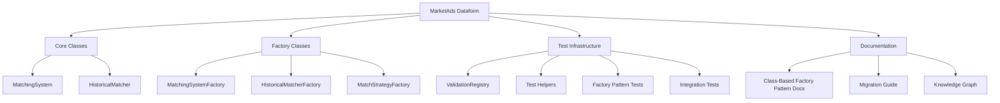
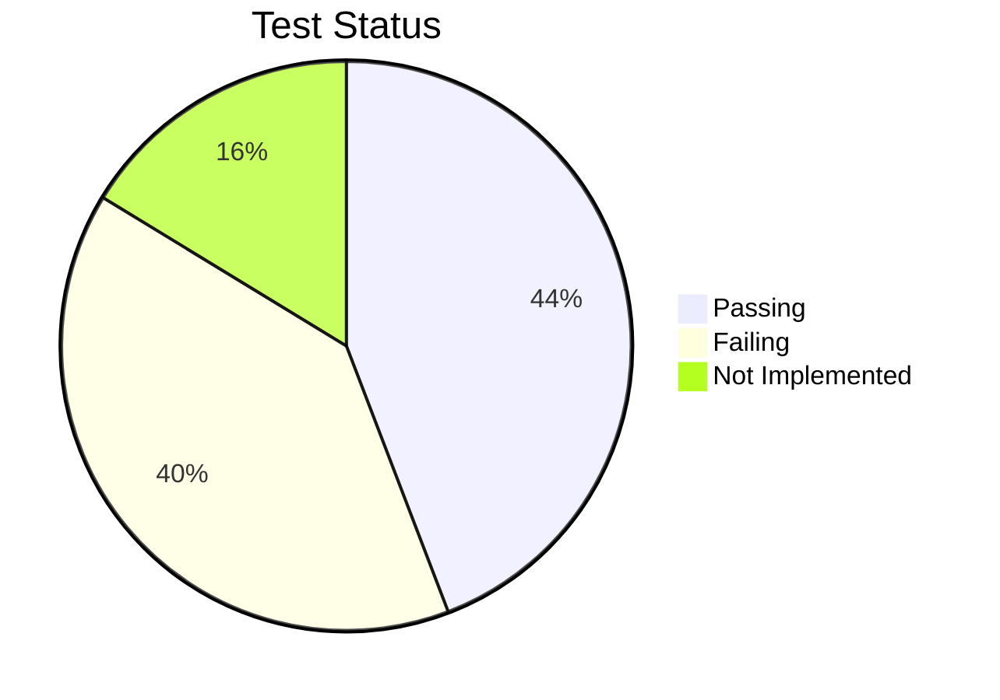
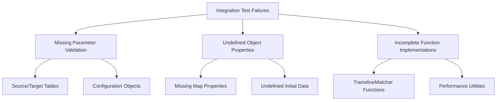
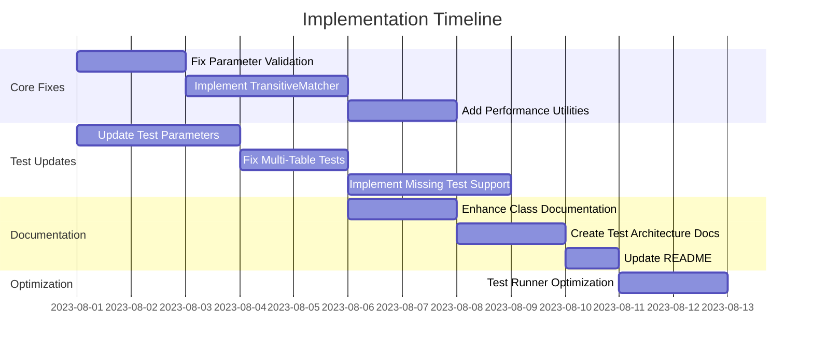

# MarketAds Dataform Project: Implementation TODO

## Introduction

This document provides a comprehensive plan for completing the MarketAds Dataform project implementation, with a focus on the Class-Based Factory Pattern integration and test infrastructure. It outlines the current status, completed items, and remaining tasks with clear steps for completion.

## Project Overview



## Current Status

The project has successfully implemented the Class-Based Factory Pattern with core classes and factories. The basic factory pattern test is passing, indicating that the foundation is solid. However, several integration tests are failing due to missing functionality and improper test configurations.

### Test Status Summary



## Completed Items

1. **Core Classes Implementation**: 
   - ✅ `MatchingSystem` class (`includes/matching_system.js`)
   - ✅ `HistoricalMatcher` class (`includes/historical_matcher.js`)
   - All core classes follow the structure outlined in [CLASS_BASED_FACTORY_PATTERN.md](docs/CLASS_BASED_FACTORY_PATTERN.md)

2. **Factory Classes Implementation**:
   - ✅ `MatchingSystemFactory` for creating `MatchingSystem` instances
   - ✅ `HistoricalMatcherFactory` for creating `HistoricalMatcher` instances
   - ✅ `MatchStrategyFactory` for creating strategy objects

3. **Test Infrastructure**:
   - ✅ Updated `run_tests.js` to support class-based factory pattern
   - ✅ Implemented `ensureClassBasedFactoryPattern()` function for global initialization
   - ✅ Created test helper functions in `includes/validation/test_helpers.js`
   - ✅ Factory pattern test (`tests/integration/factory_pattern_test.js`) is passing

4. **Documentation**:
   - ✅ Created comprehensive documentation in `docs/CLASS_BASED_FACTORY_PATTERN.md`
   - ✅ Added migration guide for existing code
   - ✅ Updated knowledge graph with new components and relationships

## Remaining Items

### 1. Fix Integration Test Failures

The primary issues with the failing integration tests are:



#### Tasks:

1. **Fix Required Parameter Validation** (Priority: High)
   - [ ] Add parameter validation in `MatchingSystem` constructor
   - [ ] Add parameter validation in `HistoricalMatcher` constructor
   - [ ] Add validation checks in `test_helpers.js` functions
   - [ ] Implement standardized error messages for missing parameters

2. **Implement Missing TransitiveMatcher Functionality** (Priority: High)
   - [ ] Create `TransitiveMatcher` class with required methods:
     - [ ] `getClusterMetrics()`
     - [ ] Support for direct and transitive cluster analysis
   - [ ] Create `TransitiveMatcherFactory` class
   - [ ] Update `test_helpers.js` with `createTransitiveMatcherTestFn()` helper

3. **Add Performance Utilities** (Priority: Medium)
   - [ ] Create `performance_utils.js` with timing functions:
     - [ ] `getCurrentTimeMs()`
     - [ ] `measureExecutionTime(fn)`
   - [ ] Add memory usage tracking utilities

### 2. Update Existing Tests

#### Tasks:

1. **Update Test Parameters** (Priority: High)
   - [ ] Review all test files and update parameter formats to match factory pattern
   - [ ] Create standardized test data objects for common test scenarios
   - [ ] Add default parameters for all test functions

2. **Fix Multi-Table Waterfall Tests** (Priority: High)
   - [ ] Update test data initialization
   - [ ] Fix source table and reference table requirements
   - [ ] Standardize test structure with helper functions

3. **Implement Missing Test Support** (Priority: Medium)
   - [ ] Create mock objects for external dependencies
   - [ ] Add support for data quality scenarios
   - [ ] Add support for incremental tables configuration

### 3. Improve Documentation

#### Tasks:

1. **Enhance Class Documentation** (Priority: Medium)
   - [ ] Add comprehensive JSDoc comments to all classes and methods
   - [ ] Create examples for common use cases
   - [ ] Document error handling patterns

2. **Create Test Architecture Documentation** (Priority: Medium)
   - [ ] Document test structure and organization
   - [ ] Create visualization of test dependencies
   - [ ] Document test helper usage

3. **Update README and Development Guidelines** (Priority: Low)
   - [ ] Add section on Class-Based Factory Pattern
   - [ ] Update development workflow to include factory pattern usage
   - [ ] Create troubleshooting guide for common test issues

### 4. Performance Optimization

#### Tasks:

1. **Test Runner Optimization** (Priority: Low)
   - [ ] Improve test discovery and loading
   - [ ] Add caching for test results
   - [ ] Optimize parallel test execution

## Implementation Plan



## Test Execution Strategy

To efficiently address the failing tests, follow this execution strategy:

1. **Start with Core Components**:
   - Fix the most basic issues first (parameter validation, error handling)
   - Implement missing functionality in core classes

2. **Update Test Infrastructure**:
   - Make test helpers more robust
   - Add standard error handling for all tests

3. **Test Incrementally**:
   - Use `node scripts/run_tests.js --test <test_id>` to run specific tests
   - Fix tests one by one, starting with the simplest failures
   - Reference the unit-testing documentation for test execution commands

```bash
# Fix and test individual components
node scripts/run_tests.js --test factory_pattern_test
node scripts/run_tests.js --test <specific_test_id>

# Test by category
node scripts/run_tests.js --type unit
node scripts/run_tests.js --type integration

# Generate test reports
node scripts/run_tests.js --report --output=test_report.txt
```

## Execution Environment Considerations

When implementing the remaining items, be aware of the following constraints:

1. **Windows Environment**:
   - Use PowerShell commands for file operations
   - Be cautious with file path separators (use `path.join` instead of hardcoded slashes)

2. **File Structure**:
   - All code should be organized according to the DATAFORM_BEST_PRACTICES.md document
   - Follow established naming conventions for consistency

3. **Test Framework Limitations**:
   - The validation framework has specific expectations for test structure
   - Test implementations must follow the patterns in the VALIDATION_FRAMEWORK.md document
   - Review the testing_plan.md for guidance on test organization

4. **Documentation Requirements**:
   - All new code should be documented following the project's standards
   - Update documentation when making significant changes

## Next Steps Checklist

- [ ] Run a complete test execution to identify any additional issues
- [ ] Prioritize fixing the parameter validation issues (most common failure pattern)
- [ ] Implement the TransitiveMatcher class and functionality
- [ ] Update test parameters to match the current factory pattern approach
- [ ] Fix Multi-Table Waterfall tests
- [ ] Create missing performance utilities
- [ ] Enhance documentation with JSDoc comments and examples
- [ ] Optimize test execution for faster development cycles

By following this plan, you should be able to systematically address the remaining issues and complete the MarketAds Dataform project implementation. 