# MarketAds Dataform Project: Implementation TODO

## Introduction

This document provides a comprehensive plan for completing the MarketAds Dataform project implementation, with a focus on the Class-Based Factory Pattern integration, API implementation, and test infrastructure. It follows a strict Test-Driven Development (TDD) approach with RED-GREEN-REFACTOR phases for each component.

## Project Overview

```mermaid
graph TD
    A[MarketAds Dataform] --> B[Core Classes]
    A --> C[Factory Classes]
    A --> D[Test Infrastructure]
    A --> E[Documentation]
    A --> F[Monitoring System]
    A --> G[API Layer]
    
    B --> B1[MatchingSystem]
    B --> B2[HistoricalMatcher]
    B --> B3[TransitiveMatcher]
    
    C --> C1[MatchingSystemFactory]
    C --> C2[HistoricalMatcherFactory]
    C --> C3[MatchStrategyFactory]
    C --> C4[TransitiveMatcherFactory]
    
    D --> D1[ValidationRegistry]
    D --> D2[Test Helpers]
    D --> D3[Factory Pattern Tests]
    D --> D4[Integration Tests]
    
    E --> E1[Class-Based Factory Pattern Docs]
    E --> E2[Migration Guide]
    E --> E3[Knowledge Graph]
    
    F --> F1[Metrics Collection]
    F --> F2[Alert Generation]
    F --> F3[Resource Monitoring]
    
    G --> G1[API Controllers]
    G --> G2[OpenAPI Integration]
    G --> G3[Middleware]
    G --> G4[API Tests]
```

## TDD Implementation Workflow

All implementation will follow the strict Test-Driven Development workflow:

1. **RED**: Write failing tests first
2. **GREEN**: Implement minimal code to make tests pass
3. **REFACTOR**: Improve code while maintaining test coverage

### Current Implementation Phase Status

| Component              | RED Phase | GREEN Phase | REFACTOR Phase | Test Count | Status |
|------------------------|-----------|-------------|----------------|------------|--------|
| Core Classes           | ✅        | ✅          | ✅             | 12/12      | DONE   |
| Factory Classes        | ✅        | ✅          | ✅             | 8/8        | DONE   |
| Test Infrastructure    | ✅        | ✅          | ✅             | 5/5        | DONE   |
| Monitoring System      | ✅        | ✅          | ✅             | 5/5        | DONE   |
| API Layer              | ❌        | ❌          | ❌             | 0/12       | TODO   |
| Intelligent Rules      | ❌        | ❌          | ❌             | 0/5        | TODO   |
| Error Handling         | ❌        | ❌          | ❌             | 0/5        | TODO   |
| Parameter Validation   | ❌        | ❌          | ❌             | 0/5        | TODO   |

## API Implementation (Based on OpenAPI Contract)

### RED Phase: API Tests (Priority: High)

1. **Authentication Tests** (Due: 2024-03-20)
   - [ ] Write tests for `/auth/login` endpoint ([tests/api/auth_login_test.js](tests/api/auth_login_test.js))
   - [ ] Write tests for `/auth/refresh` endpoint ([tests/api/auth_refresh_test.js](tests/api/auth_refresh_test.js))
   - [ ] Write tests for authentication middleware ([tests/api/auth_middleware_test.js](tests/api/auth_middleware_test.js))

2. **User Management Tests** (Due: 2024-03-21)
   - [ ] Write tests for `/users/me` endpoint ([tests/api/users_me_test.js](tests/api/users_me_test.js))

3. **Data Source Tests** (Due: 2024-03-22)
   - [ ] Write tests for listing data sources ([tests/api/data_sources_list_test.js](tests/api/data_sources_list_test.js))
   - [ ] Write tests for creating data sources ([tests/api/data_sources_create_test.js](tests/api/data_sources_create_test.js))
   - [ ] Write tests for updating data sources ([tests/api/data_sources_update_test.js](tests/api/data_sources_update_test.js))
   - [ ] Write tests for deleting data sources ([tests/api/data_sources_delete_test.js](tests/api/data_sources_delete_test.js))

4. **Reference Table Tests** (Due: 2024-03-23)
   - [ ] Write tests for reference table endpoints ([tests/api/reference_tables_test.js](tests/api/reference_tables_test.js))

5. **Matching Rule Tests** (Due: 2024-03-24)
   - [ ] Write tests for matching rule endpoints ([tests/api/matching_rules_test.js](tests/api/matching_rules_test.js))

6. **Pipeline Tests** (Due: 2024-03-25)
   - [ ] Write tests for pipeline management endpoints ([tests/api/pipelines_test.js](tests/api/pipelines_test.js))
   - [ ] Write tests for pipeline execution endpoints ([tests/api/pipeline_execution_test.js](tests/api/pipeline_execution_test.js))

7. **Match Results Tests** (Due: 2024-03-26)
   - [ ] Write tests for match results endpoints ([tests/api/match_results_test.js](tests/api/match_results_test.js))
   - [ ] Write tests for match review endpoints ([tests/api/match_review_test.js](tests/api/match_review_test.js))

8. **Dashboard Tests** (Due: 2024-03-27)
   - [ ] Write tests for dashboard metrics endpoints ([tests/api/dashboard_metrics_test.js](tests/api/dashboard_metrics_test.js))

9. **System Status Tests** (Due: 2024-03-28)
   - [ ] Write tests for system status endpoints ([tests/api/system_status_test.js](tests/api/system_status_test.js))

10. **Notification Tests** (Due: 2024-03-29)
    - [ ] Write tests for notification endpoints ([tests/api/notifications_test.js](tests/api/notifications_test.js))

11. **AI Insights Tests** (Due: 2024-03-30)
    - [ ] Write tests for AI insights endpoints ([tests/api/ai_insights_test.js](tests/api/ai_insights_test.js))

### GREEN Phase: API Implementation (Priority: High)

1. **API Framework Setup** (Due: 2024-04-02)
   - [ ] Set up Express.js framework ([includes/api/server.js](includes/api/server.js))
   - [ ] Implement authentication middleware ([includes/api/middleware/auth.js](includes/api/middleware/auth.js))
   - [ ] Set up OpenAPI validation middleware ([includes/api/middleware/openapi_validator.js](includes/api/middleware/openapi_validator.js))
   - [ ] Implement error handling middleware ([includes/api/middleware/error_handler.js](includes/api/middleware/error_handler.js))

2. **Authentication Implementation** (Due: 2024-04-03)
   - [ ] Implement `/auth/login` endpoint ([includes/api/controllers/auth_controller.js](includes/api/controllers/auth_controller.js))
   - [ ] Implement `/auth/refresh` endpoint ([includes/api/controllers/auth_controller.js](includes/api/controllers/auth_controller.js))

3. **User Management Implementation** (Due: 2024-04-04)
   - [ ] Implement `/users/me` endpoint ([includes/api/controllers/users_controller.js](includes/api/controllers/users_controller.js))

4. **Data Source Implementation** (Due: 2024-04-05)
   - [ ] Implement data source endpoints ([includes/api/controllers/data_sources_controller.js](includes/api/controllers/data_sources_controller.js))
   - [ ] Implement data source service layer ([includes/api/services/data_sources_service.js](includes/api/services/data_sources_service.js))

5. **Reference Table Implementation** (Due: 2024-04-06)
   - [ ] Implement reference table endpoints ([includes/api/controllers/reference_tables_controller.js](includes/api/controllers/reference_tables_controller.js))
   - [ ] Implement reference table service layer ([includes/api/services/reference_tables_service.js](includes/api/services/reference_tables_service.js))

6. **Matching Rule Implementation** (Due: 2024-04-07)
   - [ ] Implement matching rule endpoints ([includes/api/controllers/matching_rules_controller.js](includes/api/controllers/matching_rules_controller.js))
   - [ ] Implement matching rule service layer ([includes/api/services/matching_rules_service.js](includes/api/services/matching_rules_service.js))

7. **Pipeline Implementation** (Due: 2024-04-08)
   - [ ] Implement pipeline endpoints ([includes/api/controllers/pipelines_controller.js](includes/api/controllers/pipelines_controller.js))
   - [ ] Implement pipeline service layer ([includes/api/services/pipelines_service.js](includes/api/services/pipelines_service.js))

8. **Match Results Implementation** (Due: 2024-04-09)
   - [ ] Implement match results endpoints ([includes/api/controllers/match_results_controller.js](includes/api/controllers/match_results_controller.js))
   - [ ] Implement match results service layer ([includes/api/services/match_results_service.js](includes/api/services/match_results_service.js))

9. **Dashboard Implementation** (Due: 2024-04-10)
   - [ ] Implement dashboard metrics endpoints ([includes/api/controllers/dashboard_controller.js](includes/api/controllers/dashboard_controller.js))
   - [ ] Implement dashboard service layer ([includes/api/services/dashboard_service.js](includes/api/services/dashboard_service.js))

10. **System Status Implementation** (Due: 2024-04-11)
    - [ ] Implement system status endpoints ([includes/api/controllers/system_controller.js](includes/api/controllers/system_controller.js))
    - [ ] Implement system status service layer ([includes/api/services/system_service.js](includes/api/services/system_service.js))

11. **Notification Implementation** (Due: 2024-04-12)
    - [ ] Implement notification endpoints ([includes/api/controllers/notifications_controller.js](includes/api/controllers/notifications_controller.js))
    - [ ] Implement notification service layer ([includes/api/services/notifications_service.js](includes/api/services/notifications_service.js))

12. **AI Insights Implementation** (Due: 2024-04-13)
    - [ ] Implement AI insights endpoints ([includes/api/controllers/ai_insights_controller.js](includes/api/controllers/ai_insights_controller.js))
    - [ ] Implement AI insights service layer ([includes/api/services/ai_insights_service.js](includes/api/services/ai_insights_service.js))

13. **OpenAPI Integration** (Due: 2024-04-14)
    - [ ] Set up OpenAPI route generation ([includes/api/routes/index.js](includes/api/routes/index.js))
    - [ ] Generate API documentation from OpenAPI spec ([includes/api/docs/index.js](includes/api/docs/index.js))

### REFACTOR Phase: API Optimization (Priority: Medium)

1. **API Performance Optimization** (Due: 2024-04-16)
   - [ ] Implement request caching ([includes/api/middleware/cache.js](includes/api/middleware/cache.js))
   - [ ] Optimize database queries ([includes/api/services/query_optimizer.js](includes/api/services/query_optimizer.js))
   - [ ] Implement rate limiting ([includes/api/middleware/rate_limiter.js](includes/api/middleware/rate_limiter.js))

2. **API Security Improvements** (Due: 2024-04-18)
   - [ ] Implement CSRF protection ([includes/api/middleware/csrf.js](includes/api/middleware/csrf.js))
   - [ ] Add CORS configuration ([includes/api/middleware/cors.js](includes/api/middleware/cors.js))
   - [ ] Implement security headers ([includes/api/middleware/security_headers.js](includes/api/middleware/security_headers.js))

3. **API Documentation Improvements** (Due: 2024-04-20)
   - [ ] Enhance API documentation with examples ([docs/api_examples.md](docs/api_examples.md))
   - [ ] Create API integration guides ([docs/api_integration_guide.md](docs/api_integration_guide.md))
   - [ ] Build interactive API explorer ([includes/api/docs/explorer.js](includes/api/docs/explorer.js))

## Intelligent Rule Selection System

### RED Phase: Intelligent Rules Tests (Priority: High)

1. **Schema Analysis Tests** (Due: 2024-03-31)
   - [ ] Write tests for schema detection ([tests/rules/schema_analyzer_test.js](tests/rules/schema_analyzer_test.js))
   - [ ] Write tests for field type inference ([tests/rules/field_type_inference_test.js](tests/rules/field_type_inference_test.js))

2. **Rule Selection Tests** (Due: 2024-04-01)
   - [ ] Write tests for rule selection engine ([tests/rules/rule_selection_engine_test.js](tests/rules/rule_selection_engine_test.js))
   - [ ] Write tests for goal-based recommendation ([tests/rules/goal_analyzer_test.js](tests/rules/goal_analyzer_test.js))
   - [ ] Write tests for rule combination optimizer ([tests/rules/rule_optimizer_test.js](tests/rules/rule_optimizer_test.js))

3. **Rule Performance Tests** (Due: 2024-04-03)
   - [ ] Write tests for rule performance tracking ([tests/rules/rule_performance_tracker_test.js](tests/rules/rule_performance_tracker_test.js))
   - [ ] Write SQL tests for rule selection ([definitions/tests/rule_selection_test.sqlx](definitions/tests/rule_selection_test.sqlx))

### GREEN Phase: Intelligent Rules Implementation (Priority: High)

1. **Schema Analysis Implementation** (Due: 2024-04-05)
   - [ ] Implement schema analyzer ([includes/rules/schema_analyzer.js](includes/rules/schema_analyzer.js))
   - [ ] Implement field type inference ([includes/rules/field_type_inference.js](includes/rules/field_type_inference.js))

2. **Rule Selection Implementation** (Due: 2024-04-07)
   - [ ] Implement rule selection engine ([includes/rules/rule_selection_engine.js](includes/rules/rule_selection_engine.js))
   - [ ] Implement goal analyzer ([includes/rules/goal_analyzer.js](includes/rules/goal_analyzer.js))
   - [ ] Implement rule combination optimizer ([includes/rules/rule_optimizer.js](includes/rules/rule_optimizer.js))

3. **Rule Performance Implementation** (Due: 2024-04-09)
   - [ ] Implement rule performance tracker ([includes/rules/rule_performance_tracker.js](includes/rules/rule_performance_tracker.js))
   - [ ] Implement feedback loop system ([includes/rules/feedback_loop.js](includes/rules/feedback_loop.js))

4. **API Integration** (Due: 2024-04-11)
   - [ ] Implement rule configuration preview API ([includes/api/controllers/rule_config_controller.js](includes/api/controllers/rule_config_controller.js))
   - [ ] Implement explanation generator ([includes/rules/explanation_generator.js](includes/rules/explanation_generator.js))
   - [ ] Implement configuration serializer ([includes/rules/config_serializer.js](includes/rules/config_serializer.js))

### REFACTOR Phase: Intelligent Rules Optimization (Priority: Medium)

1. **Performance Optimization** (Due: 2024-04-13)
   - [ ] Optimize rule selection algorithm ([includes/rules/rule_selection_engine.js](includes/rules/rule_selection_engine.js))
   - [ ] Implement rule caching system ([includes/rules/rule_cache.js](includes/rules/rule_cache.js))
   - [ ] Optimize schema analysis for large datasets ([includes/rules/schema_analyzer.js](includes/rules/schema_analyzer.js))

2. **Machine Learning Integration** (Due: 2024-04-15)
   - [ ] Implement ML-based rule suggestion ([includes/rules/ml_rule_suggester.js](includes/rules/ml_rule_suggester.js))
   - [ ] Create training pipelines for rule models ([includes/rules/training_pipeline.js](includes/rules/training_pipeline.js))
   - [ ] Implement A/B testing framework ([includes/testing/rule_ab_tester.js](includes/testing/rule_ab_tester.js))

## Error Handling and Validation

### RED Phase: Error Handling Tests (Priority: High)

1. **Error System Tests** (Due: 2024-03-20)
   - [ ] Write tests for centralized error handling ([tests/errors/error_handler_test.js](tests/errors/error_handler_test.js))
   - [ ] Write tests for error classification ([tests/errors/error_types_test.js](tests/errors/error_types_test.js))
   - [ ] Write tests for error logging ([tests/logging/error_logger_test.js](tests/logging/error_logger_test.js))

2. **Validation Tests** (Due: 2024-03-22)
   - [ ] Write tests for parameter validation ([tests/validation/parameter_validation_test.js](tests/validation/parameter_validation_test.js))
   - [ ] Write tests for validation schemas ([tests/validation/validation_schema_test.js](tests/validation/validation_schema_test.js))
   - [ ] Write tests for validation error handling ([tests/validation/validation_error_test.js](tests/validation/validation_error_test.js))

### GREEN Phase: Error Handling Implementation (Priority: High)

1. **Error System Implementation** (Due: 2024-03-25)
   - [ ] Implement centralized error handler ([includes/errors/error_handler.js](includes/errors/error_handler.js))
   - [ ] Implement error classification ([includes/errors/error_types.js](includes/errors/error_types.js))
   - [ ] Implement error logging with context ([includes/logging/error_logger.js](includes/logging/error_logger.js))

2. **Validation Implementation** (Due: 2024-03-28)
   - [ ] Implement standardized validation schema ([includes/validation/validation_schema.js](includes/validation/validation_schema.js))
   - [ ] Implement validation error types ([includes/errors/validation_error.js](includes/errors/validation_error.js))
   - [ ] Add validation to core class constructors 
   - [ ] Add validation to API request handlers

### REFACTOR Phase: Error Handling Optimization (Priority: Medium)

1. **Error Recovery Implementation** (Due: 2024-04-01)
   - [ ] Implement retry mechanisms ([includes/utils/retry_utils.js](includes/utils/retry_utils.js))
   - [ ] Implement graceful degradation ([includes/utils/fallback_utils.js](includes/utils/fallback_utils.js))
   - [ ] Implement circuit breaker pattern ([includes/utils/circuit_breaker.js](includes/utils/circuit_breaker.js))

## BigQuery Optimization

### RED Phase: BigQuery Optimization Tests (Priority: Medium)

1. **Query Optimization Tests** (Due: 2024-04-01)
   - [ ] Write tests for partitioning optimization ([tests/bigquery/partitioning_test.js](tests/bigquery/partitioning_test.js))
   - [ ] Write tests for clustering optimization ([tests/bigquery/clustering_test.js](tests/bigquery/clustering_test.js))
   - [ ] Write tests for materialized view usage ([tests/bigquery/materialized_views_test.js](tests/bigquery/materialized_views_test.js))

2. **Performance Monitoring Tests** (Due: 2024-04-03)
   - [ ] Write tests for query performance tracking ([tests/bigquery/query_performance_test.js](tests/bigquery/query_performance_test.js))
   - [ ] Write tests for cost estimation ([tests/bigquery/cost_estimation_test.js](tests/bigquery/cost_estimation_test.js))
   - [ ] Write tests for resource utilization monitoring ([tests/bigquery/resource_monitoring_test.js](tests/bigquery/resource_monitoring_test.js))

### GREEN Phase: BigQuery Optimization Implementation (Priority: Medium)

1. **Query Optimization Implementation** (Due: 2024-04-06)
   - [ ] Implement partitioning strategy ([includes/bigquery/partitioning_strategy.js](includes/bigquery/partitioning_strategy.js))
   - [ ] Implement clustering strategy ([includes/bigquery/clustering_strategy.js](includes/bigquery/clustering_strategy.js))
   - [ ] Implement materialized view management ([includes/bigquery/materialized_view_manager.js](includes/bigquery/materialized_view_manager.js))

2. **Performance Monitoring Implementation** (Due: 2024-04-09)
   - [ ] Implement query performance tracking ([includes/bigquery/query_performance_tracker.js](includes/bigquery/query_performance_tracker.js))
   - [ ] Implement cost estimation ([includes/bigquery/cost_estimator.js](includes/bigquery/cost_estimator.js))
   - [ ] Implement resource utilization monitoring ([includes/bigquery/resource_monitor.js](includes/bigquery/resource_monitor.js))

## Performance Benchmarks

| Dataset Size | Records | Processing Time | Memory Usage | CPU Peak | Date Tested |
|--------------|---------|-----------------|--------------|----------|-------------|
| Small | 1,000 | 2.5s | 12.66MB | 63% | 2024-03-15 |
| Medium | 50,000 | 25s | ~500MB | 81.61% | 2024-03-15 |
| Large | 500,000 | 150s | <2GB | 85% | 2024-03-15 |

## Next Steps Checklist (Immediate Actions)

1. **API RED Phase (By 2024-03-20)**
   - [ ] Set up API testing framework
   - [ ] Write tests for authentication endpoints
   - [ ] Write tests for user management endpoints
   - [ ] Write tests for data source endpoints

2. **Error Handling RED Phase (By 2024-03-20)**
   - [ ] Write tests for centralized error handling
   - [ ] Write tests for error classification
   - [ ] Write tests for error logging

3. **Intelligent Rules RED Phase (By 2024-03-31)**
   - [ ] Write tests for schema detection
   - [ ] Write tests for field type inference
   - [ ] Write tests for rule selection engine

## Regular Review Schedule

This document will be reviewed and updated weekly (every Friday) to reflect the current status of the project and adjust priorities as needed.

Last updated: 2024-03-15