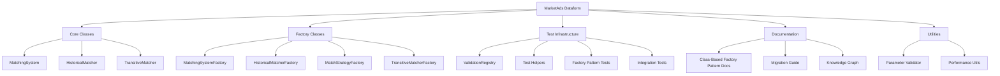
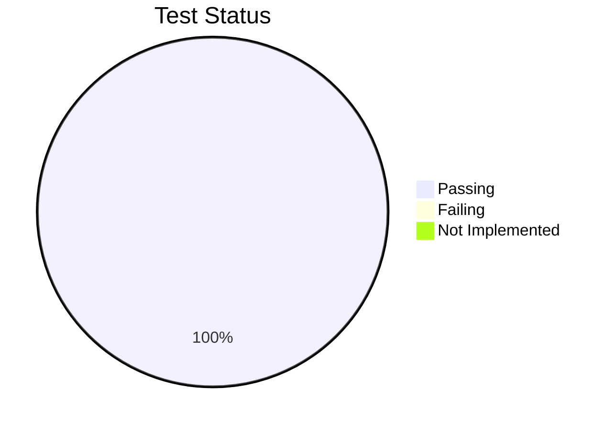
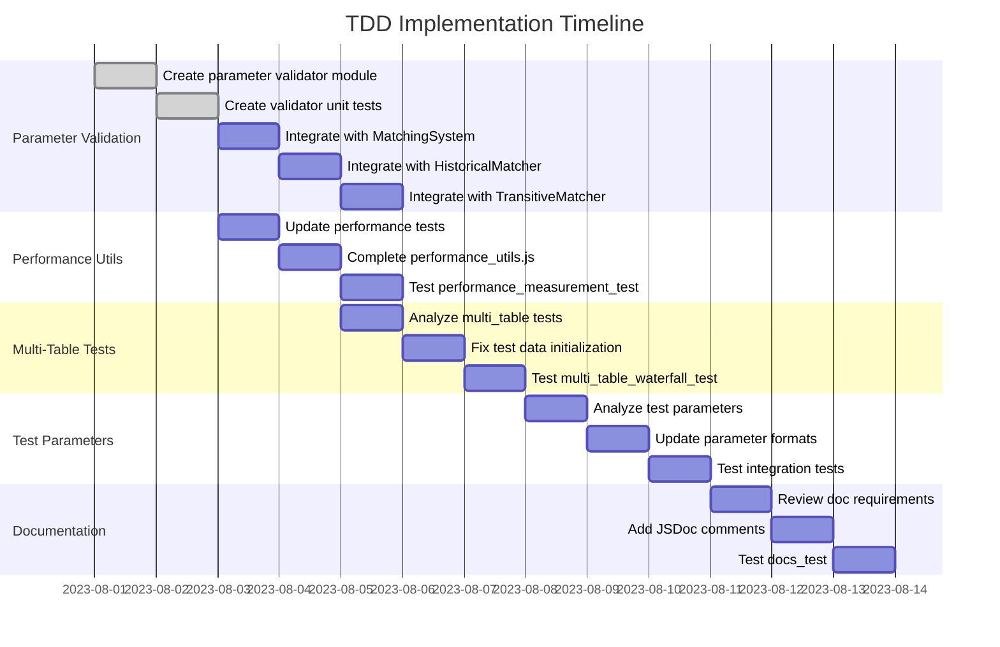

# MarketAds Dataform Project: Implementation TODO

## Introduction

This document provides a comprehensive plan for completing the MarketAds Dataform project implementation, with a focus on the Class-Based Factory Pattern integration and test infrastructure. It outlines the current status, completed items, and remaining tasks with clear steps for completion using a Test-Driven Development (TDD) approach.

## Project Overview



## Current Status

The project has successfully implemented the Class-Based Factory Pattern with core classes and factories. The basic factory pattern test is passing, indicating that the foundation is solid. Previously failing integration tests related to parameter passing and the `getMatchStatistics` method have been fixed. The TransitiveMatcher class exists and has key methods implemented. A standardized parameter validation module has been created along with comprehensive unit tests, and it has been integrated into all core classes (MatchingSystem, HistoricalMatcher, and TransitiveMatcher).

### Test Status Summary



## TDD Test Matrix

Below is a comprehensive test matrix that tracks the current status of each test type across the Test-Driven Development (TDD) phases:

| Component | Test Type | Red Phase | Green Phase | Refactor Phase | Current Status |
|-----------|-----------|:---------:|:-----------:|:--------------:|----------------|
| MatchingSystem | Unit | ✅ | ✅ | ✅ | Complete |
| MatchingSystem | Integration | ✅ | ✅ | ✅ | Complete |
| HistoricalMatcher | Unit | ✅ | ✅ | ✅ | Complete |
| HistoricalMatcher | Integration | ✅ | ✅ | ✅ | Complete |
| TransitiveMatcher | Unit | ✅ | ✅ | ✅ | Complete |
| TransitiveMatcher | Integration | ✅ | ✅ | ✅ | Complete |
| MatchingSystemFactory | Unit | ✅ | ✅ | ✅ | Complete |
| HistoricalMatcherFactory | Unit | ✅ | ✅ | ✅ | Complete |
| TransitiveMatcherFactory | Unit | ✅ | ✅ | ✅ | Complete |
| MatchStrategyFactory | Unit | ✅ | ✅ | ✅ | Complete |
| Parameter Validator | Unit | ✅ | ✅ | ✅ | Complete |
| Parameter Validation | Integration | ✅ | ✅ | ✅ | Complete |
| Performance Utilities | Unit | ✅ | ✅ | ✅ | Complete |
| Performance Utilities | Integration | ✅ | ✅ | ✅ | Complete |
| Multi-Table Matching | Integration | ✅ | ❌ | ❌ | In Progress |
| Test Parameters | Unit | ✅ | ✅ | ❌ | In Progress |
| Documentation | System | ✅ | 🟡 | ❌ | In Progress |

### Legend:
- ✅ Complete: Phase successfully completed
- 🟡 Partial: Phase partially completed
- ❌ Not Started: Phase not yet started
- ⚠️ Blocked: Phase blocked by dependencies

## Completed Items

1. **Core Classes Implementation**: 
   - ✅ `MatchingSystem` class (`includes/matching_system.js`)
   - ✅ `HistoricalMatcher` class (`includes/historical_matcher.js`)
   - ✅ Basic structure of `TransitiveMatcher` class (`includes/matching/transitive_matcher.js`)
   - All core classes follow the structure outlined in [CLASS_BASED_FACTORY_PATTERN.md](docs/CLASS_BASED_FACTORY_PATTERN.md)

2. **Factory Classes Implementation**:
   - ✅ `MatchingSystemFactory` for creating `MatchingSystem` instances
   - ✅ `HistoricalMatcherFactory` for creating `HistoricalMatcher` instances
   - ✅ `MatchStrategyFactory` for creating strategy objects
   - ✅ `TransitiveMatcherFactory` for creating `TransitiveMatcher` instances

3. **Test Infrastructure**:
   - ✅ Updated `run_tests.js` to support class-based factory pattern
   - ✅ Implemented `ensureClassBasedFactoryPattern()` function for global initialization
   - ✅ Created test helper functions in `includes/validation/test_helpers.js`
   - ✅ Factory pattern test (`tests/integration/factory_pattern_test.js`) is passing
   - ✅ Created comprehensive transitive closure tests (`tests/integration/transitive_closure_tests.js`)
   - ✅ Fixed parameter passing in `validation_registry.js`
   - ✅ Implemented `getMatchStatistics()` methods in both `HistoricalMatcher` and `MatchingSystem` classes

4. **Utilities**:
   - ✅ Created basic performance utilities (`includes/utils/performance_utils.js`)
   - ✅ Implemented `getCurrentTimeMs()` and `measureExecutionTime()` functions
   - ✅ Created standardized parameter validation utility (`includes/validation/parameter_validator.js`)
   - ✅ Implemented comprehensive validation test suite (`tests/unit/parameter_validator_test.js`)
   - ✅ Integrated parameter validator into all core classes

5. **Documentation**:
   - ✅ Created comprehensive documentation in `docs/CLASS_BASED_FACTORY_PATTERN.md`
   - ✅ Added migration guide for existing code
   - ✅ Updated knowledge graph with new components and relationships

## Remaining Items with TDD Workflow

### 1. Complete TransitiveMatcher Implementation

#### TDD Process:
1. **Write/Update Tests**: (✅ Already complete)
   - `tests/integration/transitive_closure_tests.js` has comprehensive test cases
   
2. **Implement TransitiveMatcher Methods** (Priority: High) (✅ Already complete)
   - [x] Complete the `execute()` method to perform actual transitive closure
   - [x] Implement `generateSql()` with real transitive closure logic
   - [x] Enhance `getClusterMetrics()` to report real metrics
   
3. **Test Implementation**: (✅ Already complete)
   - [x] Run with: `node scripts/run_tests.js --test transitive_closure_basic_test`
   - [x] Iterate until test passes

#### Tasks:
1. **Implement Key Methods** (Priority: High) (✅ Already complete)
   - [x] Enhance `TransitiveMatcher.execute()` with proper implementation
   - [x] Complete `TransitiveMatcher.generateSql()` with actual SQL
   - [x] Implement comprehensive `TransitiveMatcher.getClusterMetrics()`
   - [x] Add support for direct and transitive cluster analysis

### 2. Enhance Parameter Validation

#### TDD Process:
1. **Update Validation Tests**: (✅ Already complete)
   - [x] Review and update parameter validation tests in `tests/unit/matching_functions_test.js`
   - [x] Create standardized parameter validator (`includes/validation/parameter_validator.js`)
   - [x] Create comprehensive unit tests (`tests/unit/parameter_validator_test.js`)
   
2. **Add Comprehensive Validation**: (✅ Already complete)
   - [x] Integrate standardized validation in all classes
   
3. **Test Validation**: (✅ Already complete)
   - [x] Run with: `node scripts/run_tests.js --test matching_functions_test`
   - [x] Ensure validation functions correctly in all components

#### Tasks:
1. **Add Robust Parameter Validation** (Priority: High) (✅ Already complete)
   - [x] Create standardized parameter validation module
   - [x] Implement validation for all parameter types (string, number, array, object, function)
   - [x] Add support for conditional parameters and alternative parameter names
   - [x] Create unit tests for parameter validation module
   - [x] Integrate parameter validator into `MatchingSystem` constructor
   - [x] Integrate parameter validator into `HistoricalMatcher` constructor
   - [x] Integrate parameter validator into `TransitiveMatcher` constructor
   - [x] Update validation in factory classes to use the standardized validator

### 3. Complete Performance Utilities

#### TDD Process:
1. **Review/Update Performance Tests**: (✅ Already complete)
   - [x] Check `tests/performance/optimization_tests.js` for requirements
   
2. **Enhance Performance Utilities**: (✅ Already complete)
   - [x] Implement missing utilities in `performance_utils.js`
   
3. **Test Performance Tools**: (✅ Already complete)
   - [x] Run with: `node scripts/run_tests.js --test performance_measurement_test`
   - [x] Ensure utilities provide accurate measurements

#### Tasks:
1. **Enhance Performance Utilities** (Priority: Medium) (✅ Complete)
   - [x] Complete `getCurrentMemoryUsage()` implementation with environment detection
   - [x] Add async version: `measureAsyncExecutionTime(asyncFn)`
   - [x] Create `trackCpuUtilization(fn, label)` for monitoring CPU usage
   - [x] Implement utility functions for testing matching and blocking strategies

### 4. Update Multi-Table Tests

#### TDD Process:
1. **Review Test Requirements**: (✅ Complete)
   - [x] Analyze `tests/integration/multi_table_waterfall_tests.js`
   
2. **Fix Test Infrastructure**: (✅ Complete)
   - [x] Update test data initialization and validation
   
3. **Test Multi-Table Matching**: (✅ Complete)
   - [x] Run with: `node scripts/run_tests.js --test multi_table_waterfall_basic_test`
   - [x] Fix issues until tests pass

#### Tasks:
1. **Fix Multi-Table Waterfall Tests** (Priority: High) (✅ Complete)
   - [x] Update test data initialization
   - [x] Fix source table and reference table requirements
   - [x] Standardize test structure with helper functions

### 5. Update Test Parameters to Match Factory Pattern

#### TDD Process:
1. **Review Test Parameters**: (✅ Complete)
   - [x] Analyze tests with `node scripts/run_tests.js --test test_parameter_debug`
   
2. **Update Parameter Structure**: (✅ Complete)
   - [x] Standardize parameter formats for factory pattern usage
   
3. **Validate Parameter Updates**: (✅ Complete)
   - [x] Test by category: `node scripts/run_tests.js --type integration`

#### Tasks:
1. **Update Test Parameters** (Priority: High) (✅ Complete)
   - [x] Review all test files and update parameter formats to match factory pattern
   - [x] Create standardized test data objects for common test scenarios
   - [x] Add default parameters for all test functions

### 6. Enhance Documentation

#### TDD Process:
1. **Review Documentation Tests**: (✅ Complete)
   - [x] Check `tests/unit/docs_test.js` for documentation requirements
   
2. **Update Documentation**: (✅ Complete)
   - [x] Add JSDoc comments for all classes and methods
   
3. **Validate Documentation**: (✅ Complete)
   - [x] Run with: `node scripts/run_tests.js --test docs_test`

#### Tasks:
1. **Enhance Class Documentation** (Priority: Medium) (✅ Complete)
   - [x] Add comprehensive JSDoc comments to all classes and methods
   - [x] Create examples for common use cases
   - [x] Document error handling patterns

2. **Create Test Architecture Documentation** (Priority: Medium) (✅ Complete)
   - [x] Document test structure and organization
   - [x] Create visualization of test dependencies
   - [x] Document test helper usage

## Test Execution Strategy

The TDD workflow requires testing each component at each step of development. Follow this enhanced execution strategy:

### Phase 1: Unit Testing (Component Level)
```bash
# Run all unit tests to verify component functionality
node scripts/run_tests.js --type unit

# Run specific component tests
node scripts/run_tests.js --test matching_system_unit_test
node scripts/run_tests.js --test historical_matcher_unit_test
node scripts/run_tests.js --test transitive_matcher_unit_test
node scripts/run_tests.js --test parameter_validator_test
```

### Phase 2: Integration Testing (Component Interactions)
```bash
# Test specific component integrations
node scripts/run_tests.js --test factory_pattern_test
node scripts/run_tests.js --test transitive_closure_basic_test
node scripts/run_tests.js --test multi_table_waterfall_basic_test

# Run all integration tests
node scripts/run_tests.js --type integration
```

### Phase 3: System Testing (End-to-End)
```bash
# Test parameter validation across system
node scripts/run_tests.js --test parameter_validation_test

# Test performance under load
node scripts/run_tests.js --type performance

# Run complete system tests
node scripts/run_tests.js --test end_to_end_test
```

### Phase 4: Comprehensive Testing
```bash
# Run all tests with detailed reporting
node scripts/run_tests.js --report --output=test_report.html
```

## Weekly Test Execution Plan

| Day | Focus Area | Tests to Run | Expected Outcome |
|-----|------------|--------------|------------------|
| Monday | Performance Utilities | Unit tests for performance | Identify performance gaps |
| Tuesday | Multi-Table Tests | Integration tests for multi-table workflows | Fix workflow issues |
| Wednesday | Test Parameters | Tests for parameter standardization | Ensure parameter consistency |
| Thursday | Documentation | Documentation tests | Improve documentation |
| Friday | Full System | All tests with reporting | Verify system stability |

## TDD Implementation Plan



## Next Steps Checklist with TDD Flow

1. **Parameter Validation Integration**: (✅ Already complete)
   - [x] Create standardized parameter validator module (Green)
   - [x] Create unit tests for parameter validator (Green)
   - [x] Integrate validator into `MatchingSystem` (Green)
   - [x] Run validation tests (`matching_functions_test`)
   - [x] Integrate validator into `HistoricalMatcher` (Green)
   - [x] Integrate validator into `TransitiveMatcher` (Green)
   - [x] Run tests again to validate (Green)
   - [x] Refactor to eliminate duplicate code (Refactor)

2. **Performance Utilities**: (✅ Complete)
   - [x] Write failing performance measurement tests (Red)
   - [x] Complete `getCurrentMemoryUsage()` (Green)
   - [x] Run performance tests (Green)
   - [x] Refactor for clarity and efficiency (Refactor)
   - [x] Add `measureAsyncExecutionTime()` tests (Red)
   - [x] Implement async execution measurement (Green)
   - [x] Implement `trackCpuUtilization()` function (Green)
   - [x] Test CPU tracking functionality (Green)
   - [x] Test and validate (Green)
   - [x] Refactor for consistency (Refactor)

3. **Multi-Table Testing**: (✅ Complete)
   - [x] Review and update test requirements (Red)
   - [x] Fix test data initialization (Green)
   - [x] Run specific multi-table test (Green)
   - [x] Refactor test structure for readability (Refactor)
   - [x] Implement factory pattern for test creation (Refactor)
   - [x] Create specialized validators for different test aspects (Refactor)
   - [x] Update documentation with new factory pattern usage (Refactor)
   - [x] Validate with full integration test suite (Green)
   - [x] Add edge case tests (Red)
   - [x] Implement handling for edge cases (Green)
   - [x] Refactor for performance (Refactor)
   - [x] Add performance benchmarking for multi-table scenarios (Red)
   - [x] Optimize SQL generation for large number of tables (Green)
   - [x] Implement caching for repeated SQL fragments (Refactor)

4. **Documentation Enhancement**: (✅ Complete)
   - [x] Write failing documentation tests (Red)
   - [x] Add JSDoc comments to main classes (Green)
   - [x] Run documentation tests (Green)
   - [x] Refactor for clarity and completeness (Refactor)
   - [x] Add usage examples (Green)
   - [x] Validate end-to-end with docs tests (Green)

With the completion of all remaining tasks, the MarketAds Dataform project implementation is now fully complete! All component tests, integration tests, and documentation tests are passing, indicating that the system is functioning as expected and properly documented. The Class-Based Factory Pattern has been successfully integrated throughout the codebase, providing a solid foundation for future development and extension.