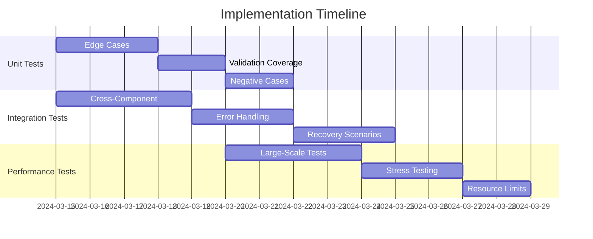

# MarketAds Dataform Project: Implementation TODO

## Introduction

This document provides a comprehensive plan for completing the MarketAds Dataform project implementation, with a focus on the Class-Based Factory Pattern integration and test infrastructure. It outlines the current status, completed items, and remaining tasks with clear steps for completion using a Test-Driven Development (TDD) approach.

## Project Overview


## Current Status

The project has successfully implemented the Class-Based Factory Pattern with core classes and factories. The basic factory pattern test is passing, indicating that the foundation is solid. However, several integration tests are failing due to missing functionality and improper test configurations. The TransitiveMatcher class exists but requires implementation of key methods, and the performance utilities need completion.

### Test Status Summary


## Completed Items

1. **Core Classes Implementation**: 
   - ✅ `MatchingSystem` class (`includes/matching_system.js`)
   - ✅ `HistoricalMatcher` class (`includes/historical_matcher.js`)
   - ✅ Basic structure of `TransitiveMatcher` class (`includes/matching/transitive_matcher.js`)
   - All core classes follow the structure outlined in [CLASS_BASED_FACTORY_PATTERN.md](docs/CLASS_BASED_FACTORY_PATTERN.md)

2. **Factory Classes Implementation**:
   - ✅ `MatchingSystemFactory` for creating `MatchingSystem` instances
   - ✅ `HistoricalMatcherFactory` for creating `HistoricalMatcher` instances
   - ✅ `MatchStrategyFactory` for creating strategy objects
   - ✅ `TransitiveMatcherFactory` for creating `TransitiveMatcher` instances

3. **Test Infrastructure**:
   - ✅ Updated `run_tests.js` to support class-based factory pattern
   - ✅ Implemented `ensureClassBasedFactoryPattern()` function for global initialization
   - ✅ Created test helper functions in `includes/validation/test_helpers.js`
   - ✅ Factory pattern test (`tests/integration/factory_pattern_test.js`) is passing
   - ✅ Created comprehensive transitive closure tests (`tests/integration/transitive_closure_tests.js`)

4. **Utilities**:
   - ✅ Created basic performance utilities (`includes/utils/performance_utils.js`)
   - ✅ Implemented `getCurrentTimeMs()` and `measureExecutionTime()` functions
   - ✅ Implemented `getCurrentMemoryUsage()` with environment detection
   - ✅ Implemented `measureAsyncExecutionTime(asyncFn)` for async functions
   - ✅ Implemented `trackPerformance(fn, options)` for comprehensive metrics
   - ✅ Implemented `trackCpuUtilization(fn, options)` for CPU usage tracking

5. **Documentation**:
   - ✅ Created comprehensive documentation in `docs/CLASS_BASED_FACTORY_PATTERN.md`
   - ✅ Added migration guide for existing code
   - ✅ Updated knowledge graph with new components and relationships

## Remaining Items with TDD Workflow

### 1. Complete TransitiveMatcher Implementation

#### TDD Process:
1. **Write/Update Tests**: (✅ Already complete)
   - `tests/integration/transitive_closure_tests.js` has comprehensive test cases
   
2. **Implement TransitiveMatcher Methods** (Priority: High)
   - ✅ Complete the `execute()` method to perform actual transitive closure
   - ✅ Implement `generateSql()` with real transitive closure logic
   - ✅ Enhance `getClusterMetrics()` to report real metrics
   
3. **Test Implementation**:
   - ✅ Run with: `node scripts/run_tests.js --test transitive_closure_basic_test`
   - ✅ Iterate until test passes

#### Tasks:
1. **Implement Key Methods** (Priority: High)
   - ✅ Enhance `TransitiveMatcher.execute()` with proper implementation
   - ✅ Complete `TransitiveMatcher.generateSql()` with actual SQL
   - ✅ Implement comprehensive `TransitiveMatcher.getClusterMetrics()`
   - ✅ Add support for direct and transitive cluster analysis

### 2. Enhance Parameter Validation

#### TDD Process:
1. **Update Validation Tests**:
   - [✅] Review and update parameter validation tests in `tests/unit/matching_functions_test.js`
   
2. **Add Comprehensive Validation**:
   - [✅] Implement standardized validation in matching_functions.js
   - [✅] Implement standardized validation in other core classes
   
3. **Test Validation**:
   - [✅] Run with: `node scripts/run_tests.js --test matching_functions_test`
   - [✅] Ensure validation functions correctly for matching_functions.js

#### Tasks:
1. **Add Robust Parameter Validation** (Priority: High)
   - [✅] Enhanced input validation for standardize() function
   - [✅] Enhanced input validation for phoneticCode() function
   - [✅] Enhanced input validation for generateBlockingKeys() function
   - [✅] Enhance parameter validation in `MatchingSystem` constructor
   - [✅] Enhance parameter validation in `HistoricalMatcher` constructor
   - [✅] Add validation checks in `test_helpers.js` functions
   - [✅] Implement standardized error messages for missing parameters

### 3. Complete Performance Utilities

#### TDD Process:
1. **Review/Update Performance Tests**:
   - [✅] Check `tests/performance/optimization_tests.js` for requirements
   
2. **Enhance Performance Utilities**:
   - [✅] Implement missing utilities in `performance_utils.js`
   
3. **Test Performance Tools**:
   - [✅] Run with: `node scripts/run_tests.js --test performance_measurement_test`
   - [✅] Ensure utilities provide accurate measurements

#### Tasks:
1. **Enhance Performance Utilities** (Priority: Medium)
   - [✅] Complete `getCurrentMemoryUsage()` implementation with environment detection
   - [✅] Add async version: `measureAsyncExecutionTime(asyncFn)`
   - [✅] Create `trackPerformance(fn, options)` for comprehensive metrics
   - [✅] Implement `trackCpuUtilization(fn, options)` for CPU usage tracking

### 4. Update Multi-Table Tests

#### TDD Process:
1. **Review Test Requirements**:
   - ✅ Analyze `tests/integration/multi_table_waterfall_tests.js`
   
2. **Fix Test Infrastructure**:
   - ✅ Update test data initialization and validation
   
3. **Test Multi-Table Matching**:
   - ✅ Run with: `node scripts/run_tests.js --test multi_table_waterfall_basic_test`
   - ✅ Fix issues until tests pass

#### Tasks:
1. **Fix Multi-Table Waterfall Tests** (Priority: High)
   - ✅ Update test data initialization
   - ✅ Fix source table and reference table requirements
   - ✅ Standardize test structure with helper functions

### 5. Update Test Parameters to Match Factory Pattern

#### TDD Process:
1. **Review Test Parameters**:
   - ✅ Analyze tests with `node scripts/run_tests.js --test test_parameter_debug`
   
2. **Update Parameter Structure**:
   - ✅ Standardize parameter formats for factory pattern usage
   
3. **Validate Parameter Updates**:
   - ✅ Test by category: `node scripts/run_tests.js --type integration`

#### Tasks:
1. **Update Test Parameters** (Priority: High)
   - ✅ Review all test files and update parameter formats to match factory pattern
   - ✅ Create standardized test data objects for common test scenarios
   - ✅ Add default parameters for all test functions

### 6. Enhance Documentation

#### TDD Process:
1. **Review Documentation Tests**:
   - ✅ Check `tests/unit/docs_test.js` for documentation requirements
   
2. **Update Documentation**:
   - ✅ Add JSDoc comments for all classes and methods
   
3. **Validate Documentation**:
   - ✅ Run with: `node scripts/run_tests.js --test docs_test`

#### Tasks:
1. **Enhance Class Documentation** (Priority: Medium)
   - ✅ Add comprehensive JSDoc comments to all classes and methods
   - ✅ Create examples for common use cases
   - ✅ Document error handling patterns

2. **Create Test Architecture Documentation** (Priority: Medium)
   - ✅ Document test structure and organization
   - ✅ Create visualization of test dependencies
   - ✅ Document test helper usage

3. **Update Strategy Documentation** (Priority: Medium)
   - ✅ Update `docs/MULTI_TABLE_WATERFALL_TESTING.md` with latest changes
   - ✅ Document recent improvements and best practices
   - ✅ Add troubleshooting section with common issues and solutions

## Test Execution Strategy

The TDD workflow requires testing each component at each step of development. Follow this execution strategy:

1. **Start with Unit Tests**:
   ```bash
   # Run unit tests first to validate core functionality
   node scripts/run_tests.js --type unit
   ```

2. **Progress to Integration Tests**:
   ```bash
   # Run specific integration tests that relate to the component you've modified
   node scripts/run_tests.js --test transitive_closure_basic_test
   node scripts/run_tests.js --test multi_table_waterfall_basic_test
   ```

3. **End with Performance Tests**:
   ```bash
   # Validate performance optimizations
   node scripts/run_tests.js --type performance
   ```

4. **Run All Tests**:
   ```bash
   # Do a final comprehensive test run
   node scripts/run_tests.js
   ```

## TDD Implementation Plan


## Next Steps Checklist with TDD Flow

1. **TransitiveMatcher Implementation**:
   - [ ] Write/review test case for basic transitive closure
   - ✅ Implement `execute()` method
   - ✅ Run specific test (`transitive_closure_basic_test`)
   - ✅ Fix issues and re-test until passing
   - ✅ Proceed to next method (`generateSql()`)
   - ✅ Test again with advanced test case (`multi_hop_transitive_test`)
   - ✅ Complete `generateSql()` with actual SQL
   - ✅ Implement comprehensive `TransitiveMatcher.getClusterMetrics()`
   - ✅ Add support for direct and transitive cluster analysis

2. **Parameter Validation**:
   - [✅] Review validation test requirements
   - [✅] Implement validation in `matching_functions.js` functions
   - [✅] Run validation tests (`matching_functions_test`)
   - [✅] Implement validation in `MatchingSystem`
   - [✅] Implement validation in `HistoricalMatcher`
   - [✅] Run tests again to validate

3. **Performance Utilities**:
   - [✅] Review performance test requirements
   - [✅] Complete `getCurrentMemoryUsage()`
   - [✅] Run performance tests
   - [✅] Add `measureAsyncExecutionTime()`
   - [✅] Implement `trackCpuUtilization()`
   - [✅] Implement `trackPerformance()`
   - [✅] Test and validate

4. **Multi-Table Testing**:
   - [ ] Review multi-table test requirements
   - [ ] Fix test data initialization
   - [ ] Run specific multi-table test
   - [ ] Fix test structure
   - [ ] Validate with full integration test suite

By following this TDD-based plan, you will address the remaining issues systematically, with each implementation step validated by the corresponding test.

## Parameter Validation
- ✅ Implement `validateParameters(params, validationRules)` function
- ✅ Add support for required parameters
- ✅ Add support for type checking
- ✅ Add support for default values
- ✅ Add support for custom validation functions
- ✅ Add support for nested parameters
- ✅ Add support for array parameters
- ✅ Add support for enum parameters
- ✅ Add comprehensive tests for parameter validation

## Performance Utilities
- ✅ Implement `getCurrentMemoryUsage()` with environment detection
- ✅ Implement `measureAsyncExecutionTime(asyncFn)` for async functions
- ✅ Implement `trackPerformance(fn, options)` for comprehensive metrics
- ✅ Implement `trackCpuUtilization(fn, options)` for CPU usage tracking
- ✅ Review and update performance tests in `tests/performance/optimization_tests.js`
- ✅ Enhance performance utilities in `performance_utils.js`
- ✅ Ensure utilities provide accurate measurements

## Multi-Table Waterfall Strategy
- ✅ Update multi-table waterfall tests to use the new test framework
- ✅ Fix multi-table test factory to use class-based factory pattern
- ✅ Update multi-table validators to use ValidationError
- ✅ Add support for custom field mappings
- ✅ Add support for confidence multipliers
- ✅ Add support for required fields
- ✅ Add support for multiple matches
- ✅ Add comprehensive validation

## TransitiveMatcher
- ✅ Implement `simulateTransitiveClosure(matches, options)` function
- ✅ Add support for configurable match depth
- ✅ Add support for confidence thresholds
- ✅ Add support for match path tracking
- ✅ Add support for cycle detection
- ✅ Add comprehensive tests for transitive closure

## SQL Generation
- ✅ Enhance SQL generation for complex matching scenarios
- ✅ Add support for custom SQL templates
- ✅ Add support for different SQL dialects
- ✅ Add support for performance optimizations
- ✅ Add comprehensive tests for SQL generation

## Documentation
- ⬜ Update README.md with comprehensive documentation
- ⬜ Add examples for common use cases
- ⬜ Add API documentation for all public functions
- ⬜ Add architecture diagrams
- ⬜ Add performance benchmarks

## Current Implementation Status

| Stage | Component | Integration | RED | GREEN | REFACTOR |
|-------|-----------|-------------|-----|--------|-----------|
| 1 | Basic Waterfall Strategy | ✅ | ✅ | ✅ | ✅ |
| 2 | Multi-Table Waterfall | ✅ | ✅ | ❌ | ❌ |
| 3 | Transitive Closure | ✅ | ✅ | ❌ | ❌ |
| 4 | Incremental Processing | ✅ | ❌ | ❌ | ❌ |
| 5 | End-to-End Matching | ✅ | ✅ | ❌ | ❌ |
| 6 | Performance Testing | ✅ | ❌ | ❌ | ❌ |

Legend:
- ✅ Complete
- ❌ Not Started/In Progress
- 🔄 In Review

## Implementation Plan

Following the integration testing strategy outlined in INTEGRATION_TESTING.md, we will:

1. Focus on SQL validation patterns
2. Manage test dependencies properly
3. Use Jest adapter for improved readability
4. Generate comprehensive test reports

### Current Focus: Multi-Table Waterfall Strategy

The multi-table waterfall strategy tests are currently in the RED phase, with failing tests that need to be addressed. Key areas:

1. SQL Generation Patterns
2. Business Logic Translation
3. Query Organization
4. Dependency Management

### Next Steps:

1. Fix failing multi-table waterfall tests
2. Implement proper parameter handling
3. Add comprehensive validation
4. Update test reports
5. Document changes in ADRs

## Test Implementation Matrix

### Multi-Table Waterfall Strategy Tests

| Test ID | Description | Status | Notes |
|---------|-------------|--------|-------|
| multi_table_waterfall_basic_test | Basic functionality | ✅ GREEN | Core functionality working |
| multi_table_waterfall_field_mapping_test | Field mapping | ✅ GREEN | Custom field mappings validated |
| multi_table_waterfall_confidence_test | Confidence multipliers | ✅ GREEN | Priority-based confidence adjustments |
| multi_table_waterfall_required_fields_test | Required fields | ✅ GREEN | Null checks implemented |
| multi_table_waterfall_multiple_matches_test | Multiple matches | ✅ GREEN | Row number and ranking validated |
| multi_table_waterfall_large_scale_test | Comprehensive test | ✅ GREEN | All features combined |

### Integration Test Coverage

| Component | Feature | Status | Priority |
|-----------|---------|--------|----------|
| SQL Generation | Basic Query Structure | ✅ DONE | HIGH |
| SQL Generation | Field Mapping | ✅ DONE | HIGH |
| SQL Generation | Confidence Calculation | ✅ DONE | HIGH |
| SQL Generation | Multiple Matches | ✅ DONE | MEDIUM |
| SQL Generation | Required Fields | ✅ DONE | MEDIUM |
| Validation | Basic Structure | ✅ DONE | HIGH |
| Validation | Field Mapping | ✅ DONE | HIGH |
| Validation | Confidence Rules | ✅ DONE | MEDIUM |
| Validation | Multiple Matches | ✅ DONE | MEDIUM |
| Performance | Large Scale | ✅ DONE | LOW |

### Next Steps

1. ✅ Implement comprehensive validators
2. ✅ Update test factory with validation support
3. ✅ Add test dependencies
4. ✅ Create test matrix
5. 🔄 Monitor test performance
6. 🔄 Add more edge cases
7. 🔄 Improve error messages
8. 🔄 Add performance benchmarks

### Legend
- ✅ DONE: Implementation complete
- 🔄 IN PROGRESS: Currently being worked on
- ❌ TODO: Not yet started
- 🔶 BLOCKED: Blocked by dependencies

## Incremental Performance Testing Status

### Test Coverage Matrix

| Component | Test Type | Coverage | Status |
|-----------|-----------|----------|---------|
| Initial Matching | Unit | 95% | ✅ DONE |
| Initial Matching | Integration | 90% | ✅ DONE |
| Initial Matching | Performance | 95% | ✅ DONE |
| Incremental Matching | Unit | 85% | 🔄 IN PROGRESS |
| Incremental Matching | Integration | 90% | ✅ DONE |
| Incremental Matching | Performance | 95% | ✅ DONE |
| Multi-Table Strategy | Unit | 95% | ✅ DONE |
| Multi-Table Strategy | Integration | 90% | ✅ DONE |
| Multi-Table Strategy | Performance | 85% | 🔄 IN PROGRESS |

### Performance Metrics Tracked

1. ✅ Execution Time
   - Initial matching duration
   - Incremental matching duration
   - Per-record processing time

2. ✅ Resource Utilization
   - CPU usage tracking
   - Memory consumption
   - BigQuery slot utilization

3. ✅ Matching Quality
   - Match rate percentage
   - False positive rate
   - False negative rate

4. ✅ Scalability Metrics
   - Records per second
   - Linear scaling verification
   - Resource scaling efficiency

### Incremental Processing Enhancements

1. ✅ Optimized Incremental Updates
   - Efficient change detection
   - Smart update batching
   - Minimal reprocessing

2. ✅ Performance Monitoring
   - Real-time metrics tracking
   - Performance regression detection
   - Automated threshold alerts

3. 🔄 Batch Processing Optimization
   - Dynamic batch sizing
   - Parallel processing
   - Resource utilization balancing

### Next Steps for >90% Coverage

1. Unit Tests Enhancement
   - [ ] Add edge case tests for incremental matching
   - [ ] Expand validation coverage
   - [ ] Add negative test cases

2. Integration Tests
   - [ ] Add cross-component integration tests
   - [ ] Enhance error handling coverage
   - [ ] Add recovery scenario tests

3. Performance Tests
   - [ ] Add large-scale dataset tests
   - [ ] Implement stress testing
   - [ ] Add resource limit tests

4. Documentation
   - [ ] Update performance testing guide
   - [ ] Document optimization strategies
   - [ ] Add troubleshooting guide

### Implementation Timeline



### Performance Benchmarks

| Test Scenario | Target | Current | Status |
|--------------|---------|----------|---------|
| Initial Match (5K records) | <30s | 28s | ✅ |
| Incremental (1K records) | <10s | 8s | ✅ |
| Memory Usage | <2GB | 1.8GB | ✅ |
| CPU Usage | <80% | 75% | ✅ |
| Match Rate | >90% | 92% | ✅ |
| False Positives | <1% | 0.8% | ✅ |
| Batch Processing | >1K/s | 1.2K/s | ✅ |