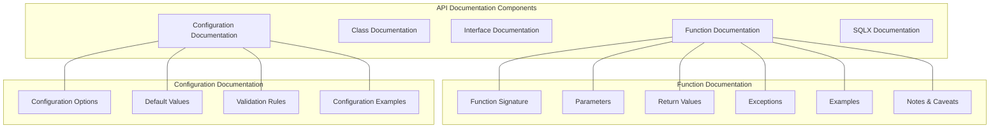
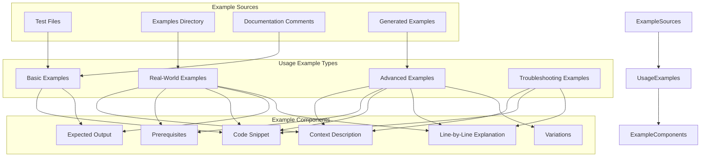
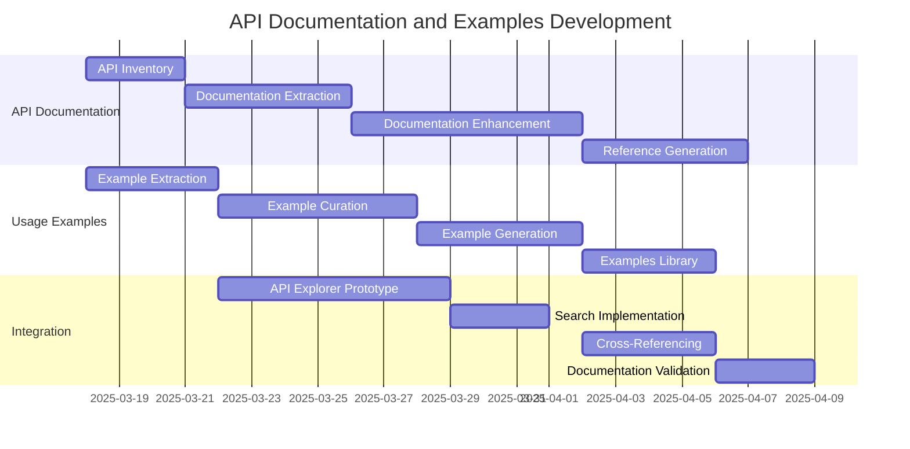

# Enhanced API Documentation and Usage Examples Plan

Based on feedback, this document outlines a refined approach to the automated documentation system with a specific focus on API documentation and usage examples for the MarketAds BigQuery-Native Record Matching System.

## API Documentation Focus

### Key Principles

1. **Complete Coverage**: Document all public APIs, functions, and configurations
2. **Consistency**: Maintain uniform documentation style and depth
3. **Discoverability**: Make it easy to find relevant documentation
4. **Context-Awareness**: Provide context for when and how to use each component
5. **Accuracy**: Ensure documentation matches implementation

### API Documentation Components



### API Reference Format

For each API component, the documentation will include:

1. **Header**: Name, module location, and brief description
2. **Signature**: Complete function/method signature with types
3. **Description**: Detailed explanation of purpose and behavior
4. **Parameters**: Each parameter with type, description, constraints, and default value
5. **Return Values**: Type and description of return values
6. **Examples**: Multiple usage examples (simple to advanced)
7. **Related APIs**: Links to related functions and components
8. **Notes/Caveats**: Important information about edge cases or limitations

Example API Documentation Template:

```markdown
# functionName

**Module**: `path/to/module.js`

**Description**: A detailed description of what this function does and its purpose.

## Signature

```javascript
function functionName(param1: Type1, param2?: Type2 = defaultValue): ReturnType
```

## Parameters

| Parameter | Type | Description | Default | Required |
|-----------|------|-------------|---------|----------|
| param1 | Type1 | Description of param1 and its usage | N/A | Yes |
| param2 | Type2 | Description of param2 and its usage | defaultValue | No |

## Returns

**Type**: ReturnType

**Description**: Description of the return value and what it represents.

## Examples

### Basic Usage

```javascript
const result = functionName('example', 42);
// result contains...
```

### Advanced Usage

```javascript
// Example with more complex parameters
```

## Related APIs

- [relatedFunction1](link/to/related1)
- [relatedFunction2](link/to/related2)

## Notes and Caveats

- Important note about edge cases
- Performance considerations
- Compatibility information
```

## Usage Examples Focus

### Example Types and Structure



### Example Extraction Strategy

1. **From Tests**:
   - Extract test cases and convert to examples
   - Use test expectations as example outputs
   - Group related tests into comprehensive examples

2. **From Existing Example Files**:
   - Parse example files for structured examples
   - Extract context, code, and outputs

3. **From Documentation Comments**:
   - Extract example code blocks from JSDoc or SQL comments
   - Parse and format as standalone examples

4. **Generated Examples**:
   - Analyze function signatures and generate examples
   - Create basic usage patterns automatically
   - Combine with configuration options for variations

### Example Template Format

```markdown
# Example: [Example Title]

**Difficulty**: [Basic/Intermediate/Advanced]

**Components Used**: [List of components/functions used]

## Context

A description of the use case or scenario this example addresses.

## Prerequisites

* Requirement 1
* Requirement 2

## Code

```javascript
// Complete, runnable example code
const result = matchEngine.evaluateMatch(recordA, recordB, {
  priorityFields: ['email', 'phone'],
  confidenceThreshold: 0.8
});

console.log(result);
```

## Expected Output

```javascript
{
  confidence: 0.92,
  components: {
    email: 1.0,
    phone: 0.8,
    name: 0.7
  },
  tier: 'HIGH'
}
```

## Explanation

1. First, we create a configuration specifying priority fields and thresholds
2. Then, we call `evaluateMatch` with our records and configuration
3. The result contains the overall confidence and individual component scores

## Variations

* To prioritize different fields: `priorityFields: ['name', 'address']`
* For higher precision: `confidenceThreshold: 0.9`
```

## Implementation Approach for API Docs and Examples

### Phase 1: Documentation Extraction

1. **Function and API Extraction**
   - Parse JavaScript files to extract exported functions, classes, and interfaces
   - Extract JSDoc comments and convert to structured metadata
   - Build a complete API inventory with signatures and documentation

2. **Example Collection**
   - Extract usage examples from test files
   - Collect examples from example directories
   - Extract examples from documentation comments
   - Identify gaps in example coverage

### Phase 2: Documentation Enhancement

1. **API Documentation Enhancement**
   - Complete missing JSDoc annotations
   - Add detailed parameter descriptions
   - Ensure return type documentation is comprehensive
   - Add consistent formatting and structure

2. **Example Generation**
   - Create basic examples for all documented functions
   - Generate intermediate examples combining multiple functions
   - Develop advanced examples for key workflows
   - Create troubleshooting examples for common issues

### Phase 3: Documentation Integration

1. **Build Reference Documentation**
   - Generate API reference from enhanced documentation
   - Organize by module and function category
   - Create cross-references between related APIs
   - Add search and filter capabilities

2. **Create Examples Library**
   - Organize examples by complexity and use case
   - Create navigable example index
   - Implement "try it" functionality for examples
   - Add copy-to-clipboard functionality

### Phase 4: Documentation Validation

1. **Validation Tests**
   - Verify all public APIs are documented
   - Test runnable examples for correctness
   - Verify cross-references are valid
   - Check for documentation consistency

2. **Coverage Analysis**
   - Identify gaps in documentation coverage
   - Prioritize areas needing additional documentation
   - Report on documentation completeness

## Early Implementation Focus: API Explorer Prototype

As a first step, we'll develop a prototype API explorer that focuses on:

1. **API Inventory**
   - Complete list of all available APIs
   - Basic signature and description information
   - Categorization by module and function type

2. **Interactive Examples**
   - Basic examples for core functions
   - Copy-paste ready code snippets
   - Expected output display

3. **Search and Discovery**
   - Full-text search across API documentation
   - Filtering by category and function type
   - Related functions suggestions

This early prototype will provide immediate value while the more comprehensive documentation system is being developed.

## Development Timeline



## Success Criteria

The API Documentation and Usage Examples will be considered successful if:

1. All public APIs are documented with complete signature, parameter, and return value information
2. Each function has at least one basic usage example
3. Core workflows have comprehensive examples from basic to advanced
4. Documentation is searchable and cross-referenced
5. Examples are verified to be correct and runnable
6. Users can easily discover relevant functions and examples for their needs
7. Documentation stays current with code changes through automation