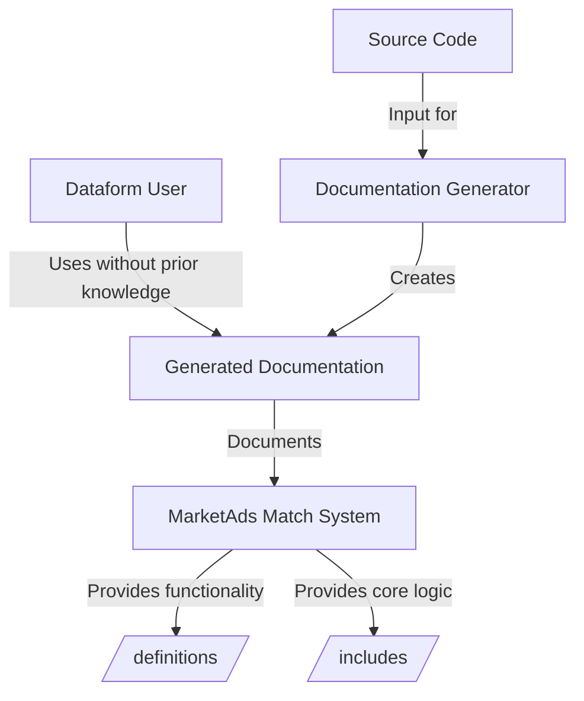
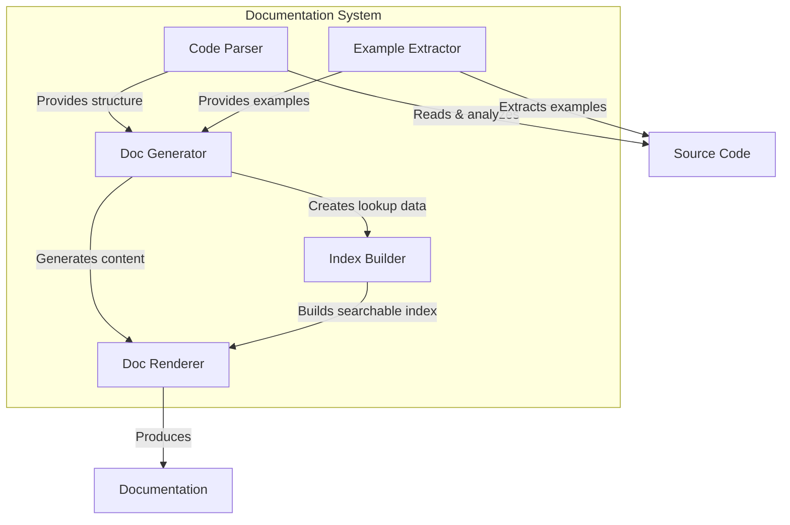
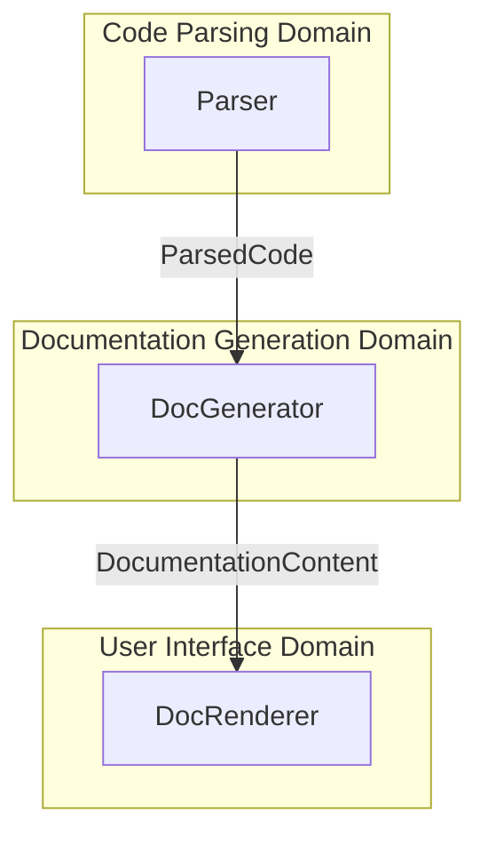

# Automated Documentation System Plan for MarketAds BigQuery-Native Record Matching System

Based on the analysis of the codebase and requirements, this document outlines a comprehensive plan for developing an automated documentation system focusing on the `/definitions/` and `/includes/` directories to make the system easily usable within Dataform without requiring prior knowledge.

## C4 Model: Documentation System Architecture

### System Context



### Container View



### Component View

```mermaid
graph TD
    subgraph "Parser Components"
        JSParser[JS Parser] -->|Parses| IncludesDir[/includes/ files]
        SQLXParser[SQLX Parser] -->|Parses| DefinitionsDir[/definitions/ files]
        JSDocs[JSDoc Extractor]
        SQLComments[SQL Comment Extractor]
        FunctionIdentifier[Function Identifier]
        
        JSParser --> JSDocs
        JSParser --> FunctionIdentifier
        SQLXParser --> SQLComments
    end
    
    subgraph "Generator Components"
        MarkdownGenerator[Markdown Generator]
        UsageExampleGenerator[Usage Example Generator]
        ConfigExplainer[Config Explainer]
        SearchIndexBuilder[Search Index Builder]
    end
    
    JSDocs --> MarkdownGenerator
    SQLComments --> MarkdownGenerator
    FunctionIdentifier --> UsageExampleGenerator
    UsageExampleGenerator --> MarkdownGenerator
    ConfigExplainer --> MarkdownGenerator
    MarkdownGenerator --> SearchIndexBuilder
```

## Domain Analysis

### Core Domains

1. **Code Parsing Domain**
   - Responsible for extracting metadata and documentation from JS and SQLX files
   - Understands code structure, JSDoc comments, and SQL comments

2. **Documentation Generation Domain**
   - Transforms parsed code into readable documentation
   - Creates examples, explanations, and reference materials

3. **User Interface Domain**
   - Provides navigable documentation for users
   - Includes search, indexing, and cross-referencing

### Boundary Contracts



**ParsedCode Contract:**
- Module name
- Module description
- Exported functions/classes
- Parameters with types and descriptions
- Return values with types and descriptions
- Examples from code or tests
- Dependencies and imports

**DocumentationContent Contract:**
- Markdown content for each module
- Usage examples with context
- Navigation structure
- Search index data
- Cross-reference information

## Architecture Decision Record (ADR)

### ADR: Automated Documentation System for MarketAds BigQuery-Native Record Matching System

#### Context
The MarketAds BigQuery-Native Record Matching System needs comprehensive documentation to enable users to leverage it easily within Dataform without prior knowledge. The documentation should cover both the `/definitions/` (SQLX) and `/includes/` (JavaScript) directories.

#### Decision
We will create an automated documentation generation system that:

1. Uses JSDoc-style comments in JavaScript files and SQL comments in SQLX files as the primary source of documentation
2. Generates Markdown files that are easy to navigate and search
3. Automatically extracts and includes usage examples from test files
4. Creates a comprehensive index of functions, modules, and capabilities
5. Generates the documentation during the build process to ensure it stays current

#### Implementation Details

1. **Parser Implementation**
   - Use `acorn` for JavaScript parsing to extract structure and comments
   - Create a custom parser for SQLX files that understands both SQL and the Dataform config block
   - Extract JSDoc-style comments and convert them to structured metadata

2. **Documentation Generator**
   - Generate Markdown files for each module
   - Create a hierarchical structure that mirrors the codebase
   - Include "Quick Start" sections for each major component
   - Generate a search index for quick lookups

3. **Integration with Build Process**
   - Add documentation generation as a pre-publication step
   - Verify documentation completeness with tests
   - Include version information in generated docs

## Implementation Plan

### Phase 1: Parser Development
1. Create JavaScript parser to extract JSDoc comments and code structure
2. Develop SQLX parser to extract SQL comments and Dataform configuration
3. Create a unified metadata format for both code types

### Phase 2: Documentation Generator Development
1. Create Markdown generator for function/module documentation
2. Develop usage example extractor and formatter
3. Implement search index builder
4. Create navigation structure generator

### Phase 3: User Interface Development
1. Create main documentation page with overview and navigation
2. Develop detailed module pages with examples
3. Implement search functionality
4. Add cross-referencing between related functions

### Phase 4: Build Integration
1. Create documentation generation script
2. Add to build process
3. Add documentation validation tests
4. Create documentation update checker

## Detailed Components

### 1. Code Parser

```javascript
// Parser implementation overview
class CodeParser {
  constructor(options) {
    this.jsParser = new JavaScriptParser(options);
    this.sqlxParser = new SQLXParser(options);
  }
  
  async parseDirectory(dir) {
    const files = await getFiles(dir);
    const jsFiles = files.filter(f => f.endsWith('.js'));
    const sqlxFiles = files.filter(f => f.endsWith('.sqlx'));
    
    const jsResults = await Promise.all(jsFiles.map(f => this.jsParser.parseFile(f)));
    const sqlxResults = await Promise.all(sqlxFiles.map(f => this.sqlxParser.parseFile(f)));
    
    return [...jsResults, ...sqlxResults];
  }
}
```

### 2. Documentation Generator

```javascript
// Documentation generator implementation overview
class DocGenerator {
  constructor(options) {
    this.markdownRenderer = new MarkdownRenderer(options);
    this.exampleExtractor = new ExampleExtractor(options);
    this.indexBuilder = new IndexBuilder(options);
  }
  
  async generateDocs(parsedCode) {
    const examples = await this.exampleExtractor.extractExamples(parsedCode);
    const enhancedCode = this.enhanceWithExamples(parsedCode, examples);
    const docs = this.markdownRenderer.render(enhancedCode);
    const index = this.indexBuilder.buildIndex(enhancedCode);
    
    return { docs, index };
  }
}
```

### 3. Output Structure

```
/docs/
  index.md                  # Main documentation page
  /functions/               # Function reference 
    /matching/              # Matching functions
      cosine_similarity.md  # Individual function docs
      jaccard_similarity.md
      ...
  /modules/                 # Module reference
    match_engine.md
    rule_optimizer.md
    ...
  /examples/                # Usage examples
    basic_matching.md
    advanced_matching.md
    ...
  /configs/                 # Configuration reference
    field_weights.md
    thresholds.md
    ...
  /search/                  # Search functionality
    search_index.json       # Search index
```

## Technology Choices

1. **Parsing Libraries**
   - JavaScript: Acorn or Esprima for JS parsing
   - SQL: Custom parser or pg-query for SQL parsing
   - JSDoc: Comment-parser for JSDoc extraction

2. **Documentation Generation**
   - Markdown-it for Markdown generation
   - Highlight.js for code highlighting
   - Lunr.js for search indexing

3. **Build Integration**
   - Node.js script for documentation generation
   - Jest for documentation validation tests
   - Version extraction from package.json

## Expected Outcome

The automated documentation system will create comprehensive, navigable documentation that enables users to leverage the MarketAds BigQuery-Native Record Matching System easily within Dataform without prior knowledge. The documentation will be generated automatically during the build process, ensuring it stays current with the codebase.