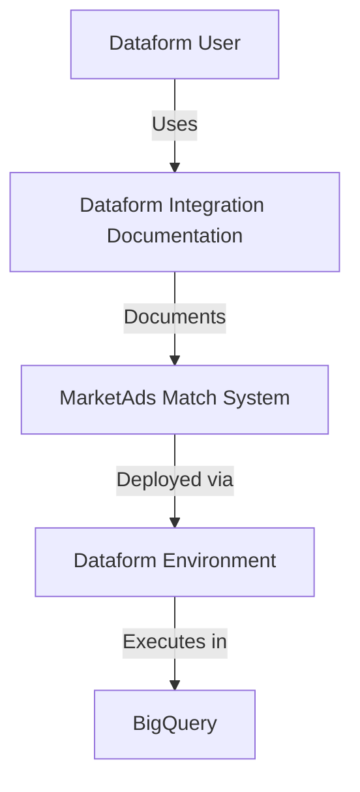
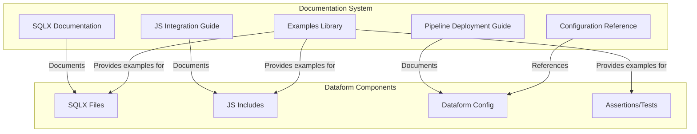
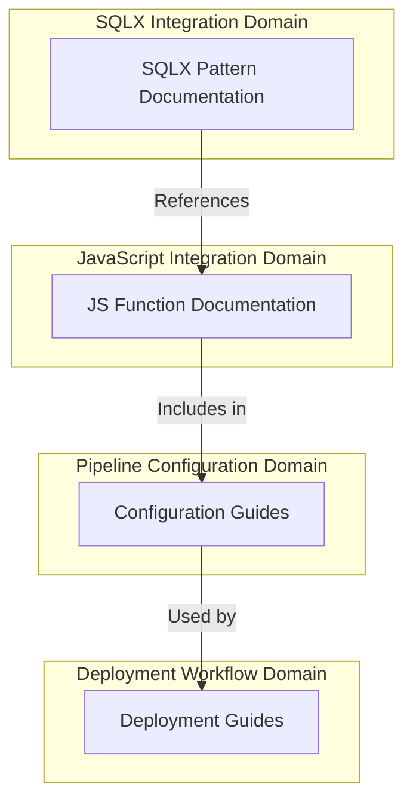
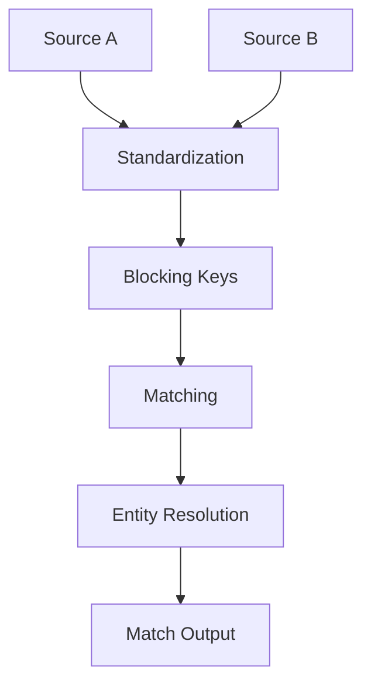

# Dataform-Focused Documentation Plan for MarketAds Matching System

This document outlines a focused plan for creating documentation specifically tailored to using the MarketAds BigQuery-Native Record Matching System within the Dataform environment and deploying Dataform pipelines.

## C4 Model: Dataform Integration Documentation

### System Context Diagram



### Container View Focusing on Dataform



## Domain Analysis: Dataform-Specific Documentation

### Core Documentation Domains

1. **SQLX Integration Domain**
   - Documents how to use matching functions in SQLX files
   - Covers configurations for matching operations in SQL context
   - Includes best practices for SQL performance with matching system

2. **JavaScript Integration Domain**
   - Documents how to import and use JS matching functions
   - Covers configuration of matching parameters
   - Explains extension points and customization options

3. **Pipeline Configuration Domain**
   - Documents how to configure dependency chains for matching
   - Covers incremental vs. full refresh matching strategies
   - Explains monitoring and testing approaches

4. **Deployment Workflow Domain**
   - Documents CI/CD integration for matching pipelines
   - Covers environment-specific configurations
   - Explains validation and testing frameworks

### Boundary Contracts for Dataform-Specific Documentation



## Architecture Decision Record (ADR): Dataform Documentation Approach

### Context

The MarketAds BigQuery-Native Record Matching System needs documentation specifically focused on its usage within the Dataform environment to enable users without prior knowledge to effectively deploy matching pipelines.

### Decision

We will create a Dataform-focused documentation system that:

1. Provides clear examples of SQLX files implementing matching operations
2. Documents JavaScript function integration patterns for Dataform
3. Includes complete pipeline deployment examples for common matching scenarios
4. Offers configuration templates for different matching goals
5. Integrates with Dataform's existing documentation patterns

### Implementation Details

1. **SQLX Documentation Structure**
   - Organized by matching operation type (customer match, address match, etc.)
   - Each operation includes complete SQLX file examples
   - Configuration blocks explained in detail
   - Performance considerations for each pattern

2. **JavaScript Function Integration**
   - Clear import patterns for Dataform
   - Function parameter documentation with Dataform-specific context
   - Return value handling in SQLX context
   - Error handling within Dataform pipelines

3. **Pipeline Configuration**
   - Templates for common matching workflows
   - Dependency management for matching pipelines
   - Incremental update configuration for matching tables
   - Testing frameworks for match quality

## Implementation Plan: Dataform-Focused Documentation

### Phase 1: Document SQLX Patterns for Matching Operations

1. **Identify Core SQLX Patterns**
   - Extract existing SQLX patterns from codebase
   - Classify by match operation type
   - Document configuration options for each pattern

2. **Create SQLX Templates**
   - Develop standardized SQLX templates for each match operation
   - Include pre-configured options for common scenarios
   - Provide clear comments explaining each section

3. **Document Performance Optimization**
   - SQLX-specific performance considerations
   - BigQuery optimization for matching operations
   - Partitioning and clustering recommendations

### Phase 2: Document JavaScript Function Integration

1. **Document JS Import Patterns**
   - How to correctly import match functions in Dataform
   - Module organization and dependency structure
   - Version management for matching functions

2. **Function Usage Documentation**
   - Parameter documentation with Dataform context
   - Configuration object structure and options
   - Return value handling in SQLX context

3. **Customization Guide**
   - How to extend or customize match functions
   - Creating new match strategies
   - Integration with existing matching workflows

### Phase 3: Create Pipeline Deployment Documentation

1. **Pipeline Configuration Guide**
   - Dependency configuration for match pipelines
   - Incremental vs. full refresh strategies
   - Configuration for different match goals (precision vs. recall)

2. **Deployment Workflow Documentation**
   - CI/CD integration for match pipelines
   - Environment-specific configuration
   - Validation and testing frameworks

3. **Operations Guide**
   - Monitoring match pipeline performance
   - Troubleshooting common issues
   - Maintenance and update procedures

### Phase 4: Develop Dataform-Specific Examples Library

1. **Basic Match Pipeline Examples**
   - Complete, runnable examples for simple match operations
   - Step-by-step explanations of each component
   - Configuration variations for different scenarios

2. **Advanced Match Pipeline Examples**
   - Multi-table matching workflows
   - Complex match strategies (waterfall, hybrid approaches)
   - Performance-optimized configurations

3. **Specialized Use Case Examples**
   - Identity resolution across multiple sources
   - Incremental matching with historical data
   - Large-scale matching optimizations

## Example Documentation Templates

### SQLX Pattern Documentation Template

```markdown
# Customer Matching SQLX Pattern

This SQLX pattern implements customer matching using the MarketAds matching engine.

## Configuration

```js
config {
  type: "table",
  dependencies: ["source_customers_a", "source_customers_b"],
  description: "Matches customers between two source tables using email and name"
}
```

## SQLX Implementation

```sql
SELECT
  ${matching.applyCustomerMatching({
    sourceTableA: "source_customers_a",
    sourceTableB: "source_customers_b",
    matchFields: ["email", "firstName", "lastName", "phone"],
    confidenceThreshold: 0.8,
    outputFormat: "pairs"
  })}
```

## Parameters

| Parameter | Description | Required | Default |
|-----------|-------------|----------|---------|
| sourceTableA | First table to match | Yes | - |
| sourceTableB | Second table to match | Yes | - |
| matchFields | Fields to use for matching | Yes | - |
| confidenceThreshold | Minimum confidence score (0-1) | No | 0.7 |
| outputFormat | Format of results ("pairs" or "clusters") | No | "pairs" |

## Example Output

The query generates a table with the following schema:

| Column | Type | Description |
|--------|------|-------------|
| source_a_id | STRING | ID from source A |
| source_b_id | STRING | ID from source B |
| confidence | FLOAT | Match confidence score |
| match_components | STRUCT | Individual field match scores |
| match_type | STRING | Type of match (exact, fuzzy, etc.) |

## Performance Considerations

- This query performs best with tables under 10 million rows
- Consider adding a blocking strategy for larger tables
- Partitioning on match_date improves incremental processing
```

### JavaScript Integration Documentation Template

```markdown
# Customer Matching Functions for Dataform

This document explains how to use customer matching functions in your Dataform SQLX files.

## Importing the Functions

Add this at the top of your SQLX file:

```js
const { matching } = require("../includes/matching");
```

## Basic Usage

```js
// Inside your SQLX file
config {
  type: "table"
}

SELECT
  ${matching.applyCustomerMatching({
    sourceTableA: "source_customers",
    sourceTableB: "target_customers",
    matchFields: ["email", "name", "phone"]
  })}
```

## Common Patterns

### 1. Basic Customer Matching

```js
const matchQuery = matching.applyCustomerMatching({
  sourceTableA: "sourceTable",
  sourceTableB: "targetTable",
  matchFields: ["email", "name", "phone"]
});
```

### 2. High Precision Matching

```js
const matchQuery = matching.applyCustomerMatching({
  sourceTableA: "sourceTable",
  sourceTableB: "targetTable",
  matchFields: ["email", "phone"],
  confidenceThreshold: 0.9,
  prioritizeExactMatches: true
});
```

### 3. Incremental Matching

```js
config {
  type: "incremental"
}

${when(incremental(), `WHERE source_updated_at > (SELECT MAX(source_updated_at) FROM ${self()})`)}

const matchQuery = matching.applyCustomerMatching({
  sourceTableA: "source_customers",
  sourceTableB: "target_customers",
  matchFields: ["email", "name", "phone"],
  incrementalField: "source_updated_at"
});
```
```

### Pipeline Configuration Template

```markdown
# Customer Matching Pipeline Configuration

This document explains how to configure a complete customer matching pipeline in Dataform.

## Pipeline Overview



## Required Files

1. **Source Definitions**
   - `definitions/sources/source_a.sqlx`
   - `definitions/sources/source_b.sqlx`

2. **Standardization**
   - `definitions/intermediate/standardized_source_a.sqlx`
   - `definitions/intermediate/standardized_source_b.sqlx`

3. **Blocking**
   - `definitions/matching/blocking_keys.sqlx`

4. **Matching**
   - `definitions/matching/customer_matches.sqlx`

5. **Resolution**
   - `definitions/matching/customer_clusters.sqlx`

## Deployment Steps

1. **Configure dataform.json**

```json
{
  "defaultSchema": "matching",
  "assertionSchema": "matching_assertions",
  "warehouse": "bigquery",
  "defaultDatabase": "your-project-id"
}
```

2. **Configure package.json dependencies**

```json
{
  "dependencies": {
    "@dataform/core": "1.15.0"
  }
}
```

3. **Deploy Command**

```bash
dataform run --project-dir=. --environment=production
```

## Monitoring and Validation

1. **Create assertions in assertions/matching_quality.sqlx**

```js
config { type: "assertion" }

SELECT *
FROM ${ref("customer_matches")}
WHERE confidence < 0.5 AND match_type = 'exact'
```

2. **Monitor pipeline performance**

Set up BigQuery monitoring on the matching queries to track:
- Query runtime
- Slot usage
- Bytes processed

## Common Issues and Solutions

| Issue | Solution |
|-------|----------|
| Long-running matches | Add blocking strategy or partition source data |
| Low match quality | Adjust confidence thresholds or add more match fields |
| Failed incremental updates | Check incremental field is properly indexed |
```

## Dataform-Specific API Reference Structure

### 1. SQLX Functions

```markdown
# SQLX Functions Reference

## applyCustomerMatching

Generates SQL for matching customers between two tables.

### Usage in SQLX

```js
${matching.applyCustomerMatching({
  sourceTableA: "source_customers",
  sourceTableB: "target_customers", 
  matchFields: ["email", "name", "phone"]
})}
```

### Parameters

| Parameter | Type | Description | Default |
|-----------|------|-------------|---------|
| sourceTableA | string | Name of first table to match | Required |
| sourceTableB | string | Name of second table to match | Required |
| matchFields | string[] | Fields to use for matching | Required |
| confidenceThreshold | number | Minimum match confidence threshold | 0.7 |
| outputFormat | string | Format of output ("pairs" or "clusters") | "pairs" |

### Returns

SQL query string that performs the matching operation.

### Notes

- Ensure source tables have standardized fields for best results
- Remember to add appropriate table aliases when embedding in larger queries
```

### 2. JavaScript Configuration Reference

```markdown
# JavaScript Configuration Reference

## Field Type Mapping

When configuring matching operations, map your field names to semantic types:

```js
const fieldMappings = [
  { field: "customer_email", type: "email" },
  { field: "first_name", type: "firstName" },
  { field: "last_name", type: "lastName" },
  { field: "phone_number", type: "phone" },
  { field: "dob", type: "dateOfBirth" },
  { field: "zip", type: "postalCode" }
];
```

### Available Semantic Types

| Semantic Type | Description | Matching Algorithm | Weight |
|---------------|-------------|-------------------|--------|
| email | Email address | Exact + domain match | 0.9 |
| phone | Phone number | Exact + last 4 digits | 0.8 |
| firstName | First name | Jaro-Winkler | 0.6 |
| lastName | Last name | Jaro-Winkler | 0.7 |
| fullName | Full name | Token + Jaro-Winkler | 0.8 |
| dateOfBirth | Date of birth | Component match | 0.8 |
| address | Street address | Token similarity | 0.5 |
| postalCode | Postal/ZIP code | Prefix match | 0.7 |
```

## Success Criteria

The Dataform-focused documentation will be considered successful if:

1. Users can implement matching operations in their Dataform workflows without prior knowledge of the matching system
2. Documentation provides clear examples for every common matching scenario in Dataform
3. Configuration templates cover different matching goals and scenarios
4. Pipeline examples show complete, working implementations for various use cases
5. Troubleshooting guides address common issues specific to Dataform deployment
6. All documentation follows Dataform conventions and integrates with existing Dataform patterns
7. Examples are directly usable in a Dataform environment with minimal modification

## Next Steps: API Explorer for Dataform

As a first deliverable, we'll create a specialized API Explorer for Dataform that focuses on:

1. **SQLX Function Library**: Interactive documentation of all SQLX functions with copy-paste examples
2. **Configuration Template Library**: Pre-configured templates for common Dataform matching scenarios
3. **Complete Pipeline Examples**: End-to-end examples of Dataform pipelines implementing matching
4. **Performance Optimization Guide**: Dataform-specific optimizations for match queries

This initial deliverable will provide immediate value while the more comprehensive documentation system is being developed.