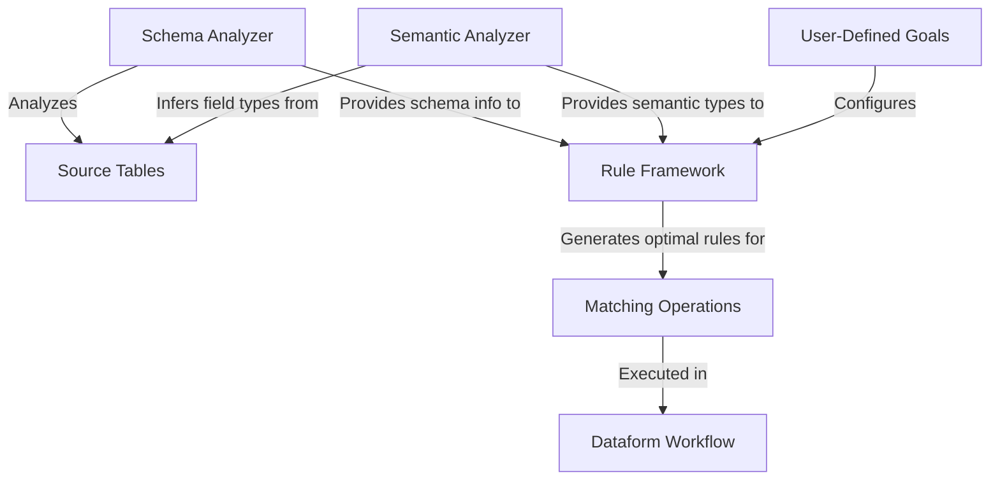

# Rule Framework, Semantic Analyzer, and Schema Analyzer Integration in Dataform

This document extends the Dataform-focused documentation plan with specific examples of how to integrate the rule framework, semantic analyzer, and schema analyzers within Dataform constraints.

## Rule Framework Integration

The intelligent rule selection system automatically recommends optimal matching rules based on table schemas, field types, and user-defined goals. Here's how to integrate it within Dataform:

### Dataform Integration Architecture



## Implementation Examples

### 1. Schema Analysis Phase (Parameterized)

```js
// definitions/analysis/schema_analysis.sqlx
config {
  type: "table",
  description: "Analyzes source schemas and stores analysis results",
  vars: {
    project_id: "your_project_id", // Replace with your project ID
    dataset_id: "your_dataset_id",  // Replace with your dataset ID
    sourceTableA: "your_dataset.source_customers_a", // Replace with your source table A
    sourceTableB: "your_dataset.source_customers_b"  // Replace with your source table B
  }
}

// Import needed modules
const { schemaAnalyzer } = require("../../includes/rules/schema_analyzer");
const { fieldTypeInference } = require("../../includes/rules/field_type_inference");

// Define source tables to analyze (now parameterized via vars)
const sourceTables = [
  dataform.projectConfig.vars.sourceTableA,
  dataform.projectConfig.vars.sourceTableB
];

// Generate analysis query - project_id and dataset_id are now parameters
js`WITH schema_analysis AS (
  ${schemaAnalyzer.generateAnalysisSql(dataform.projectConfig.vars.project_id, dataform.projectConfig.vars.dataset_id, sourceTables)}
),
field_type_inference AS (
  ${fieldTypeInference.generateInferenceSql(dataform.projectConfig.vars.project_id, dataform.projectConfig.vars.dataset_id, dataform.projectConfig.vars.table_id)}
)

-- Combine the analysis results
SELECT 
  'schema_analysis' as analysis_type,
  table_name,
  field_name,
  TO_JSON(schema_properties) as properties
FROM schema_analysis
UNION ALL
SELECT
  'field_type_inference' as analysis_type,
  table_name,
  field_name,
  TO_JSON(inferred_types) as properties
FROM field_type_inference
`
```

### 2. Rule Generation Phase

```js
// definitions/analysis/rule_recommendation.sqlx
config {
  type: "table",
  description: "Generates rule recommendations based on schema analysis",
  dependencies: ["schema_analysis"]
}

// Import rule framework
const { intelligentRuleSelector } = require("../../includes/rules/intelligent_rule_selector");

// Define matching goals
const matchingGoals = [
  {
    name: "high_precision",
    description: "Find only high-confidence matches",
    config: { precision: 0.9, recall: 0.5 }
  },
  {
    name: "high_recall",
    description: "Find as many potential matches as possible",
    config: { precision: 0.5, recall: 0.9 }
  },
  {
    name: "balanced",
    description: "Balance precision and recall",
    config: { precision: 0.7, recall: 0.7 }
  }
];

// Generate rule recommendations for each goal
js`WITH 
${matchingGoals.map(goal => `
  ${goal.name}_rules AS (
    ${intelligentRuleSelector.generateRecommendationSql({
      schemaAnalysisTable: "schema_analysis",
      goalConfig: goal.config
    })}
  )`).join(',\n')}

-- Combine all rule recommendations
${matchingGoals.map(goal => `
  SELECT
    '${goal.name}' as goal_name,
    '${goal.description}' as goal_description,
    rule_type,
    rule_config,
    estimated_precision,
    estimated_recall,
    estimated_performance
  FROM ${goal.name}_rules`).join('\nUNION ALL\n')}
`
```

### 3. Matching Implementation Phase

```js
// definitions/matching/customer_matching.sqlx
config {
  type: "table",
  description: "Performs customer matching using recommended rules",
  dependencies: ["rule_recommendation"]
}

// Import matching engine
const { matchEngine } = require("../../includes/matching/engine");

// Select a goal to use for matching
const matchingGoal = "balanced";

// Generate matching SQL using the recommended rules
js`WITH recommended_rules AS (
  SELECT rule_config
  FROM ${ref("rule_recommendation")}
  WHERE goal_name = '${matchingGoal}'
  LIMIT 1
)

-- Apply incremental matching logic
${matchEngine.generateMatchingSql({
  sourceTableA: "source_customers_a",
  sourceTableB: "source_customers_b",
  rulesConfig: "recommended_rules.rule_config"
})}`
```

## Integration with Dataform Operations

### Incremental Updates with Rule Framework

```js
// definitions/matching/incremental_customer_matching.sqlx
config {
  type: "incremental",
  description: "Incrementally updates matches using the rule framework",
  dependencies: ["rule_recommendation"]
}

// Import necessary modules
const { intelligentRuleSelector } = require("../../includes/rule_engine");
const { matchEngine } = require("../../includes/matching/engine");

// Select the matching goal
const matchingGoal = "high_precision";

// Generate matching SQL with incremental processing
js`WITH recommended_rules AS (
  SELECT rule_config
  FROM ${ref("rule_recommendation")}
  WHERE goal_name = '${matchingGoal}'
  LIMIT 1
)

-- Apply incremental matching logic
${matchEngine.generateIncrementalMatchingSql({
  sourceTableA: "source_customers_a",
  sourceTableB: "source_customers_b",
  rulesConfig: "recommended_rules.rule_config",
  incrementalConfig: {
    field: "updated_at",
    condition: when(incremental(), `source_updated_at > (SELECT MAX(source_updated_at) FROM ${self()})`)
  }
})}`
```

### Performance Monitoring with Analysis Framework

```js
// definitions/monitoring/rule_performance_tracking.sqlx
config {
  type: "table",
  description: "Tracks performance of matching rules over time",
  dependencies: ["customer_matching"]
}

// Import performance tracker
const { performanceTracker } = require("../../includes/rule_performance_tracker");

// Generate performance monitoring SQL
js`${performanceTracker.generatePerformanceTrackingSql({
  matchResultsTable: ref("customer_matching"),
  performanceMetrics: ["precision", "recall", "f1_score", "execution_time"],
  dimensions: ["rule_type", "goal_name", "execution_date"]
})}`
```

## Implementation of the Schema Analyzer

### Basic Usage Example

```js
// examples/schema_analyzer_example.sqlx
config {
  type: "operations",
  description: "Example of using the schema analyzer"
}

// Import schema analyzer
const { schemaAnalyzer } = require("../includes/schema_analyzer");

// Analyze a table schema
const tableToAnalyze = "source_customers_a";
const analysisResults = schemaAnalyzer.analyzeTable(tableToAnalyze);

// Output example schema analysis as a comment
var analysisOutput = `
/*
Schema Analysis Results for ${tableToAnalyze}:
${JSON.stringify(analysisResults, null, 2)}

Field Quality Metrics:
- Completeness: ${analysisResults.qualityMetrics.completeness}
- Uniqueness: ${analysisResults.qualityMetrics.uniqueness}
- Consistency: ${analysisResults.qualityMetrics.consistency}

Recommended Fields for Matching:
${analysisResults.recommendedMatchFields.join(', ')}
*/
`;

// Execute a simple SQL query with the analysis as a comment
js`
${analysisOutput}

SELECT 1 as example
`
```

## Implementation of the Semantic Analyzer

### Field Type Inference Example

```js
// examples/semantic_analyzer_example.sqlx
config {
  type: "operations",
  description: "Example of using the semantic analyzer"
}

// Import field type inference module
const { fieldTypeInference } = require("../includes/semantic_types");

// Infer field types for a table
const tableToAnalyze = "source_customers_a";
const inferredTypes = fieldTypeInference.inferFieldTypes(sourceTable);

// Generate a field mapping based on the inferred types
js`SELECT
  ${fieldTypes.generateFieldMappingSql({
    table: sourceTable,
    includeConfidence: true
  })}`
```

## Implementation of the Rule Framework

### Rule Recommendation Example

```js
// examples/rule_framework_example.sqlx
config {
  type: "operations",
  description: "Example of using the rule framework"
}

// Import rule selector
const { intelligentRuleSelector } = require("../includes/rule_engine");

// Source tables to match
const sourceTableA = "source_customers_a";
const sourceTableB = "source_customers_b";

// Get rule recommendations with explanation
const ruleRecommendation = intelligentRuleSelector.recommendRules(
  sourceTableA,
  sourceTableB,
  "Find high quality matches with good precision"
);

const explanation = intelligentRuleSelector.explainRecommendation(
  ruleRecommendation
);

// Output example rule recommendation as a comment
var recommendationOutput = `
/*
Rule Recommendation for matching ${sourceTableA} and ${sourceTableB}:
${JSON.stringify(ruleRecommendation, null, 2)}

Explanation:
${explanation}

Generated SQL Preview:
${ruleRecommendation.generateSql({
  sourceTableA: sourceTableA,
  sourceTableB: sourceTableB,
  limit: 10
})}`
*/;

// Execute a simple SQL query with the recommendation as a comment
js`
${recommendationOutput}

SELECT 1 as example
`
```

These examples demonstrate how to integrate the rule framework, semantic analyzer, and schema analyzers within Dataform constraints. The next step is to implement these examples and create the necessary documentation.